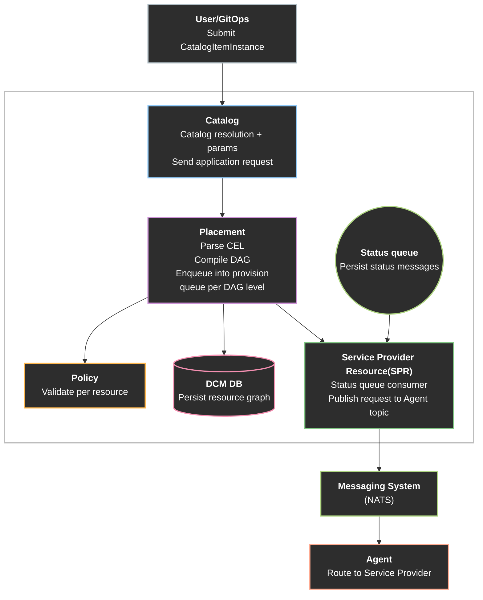
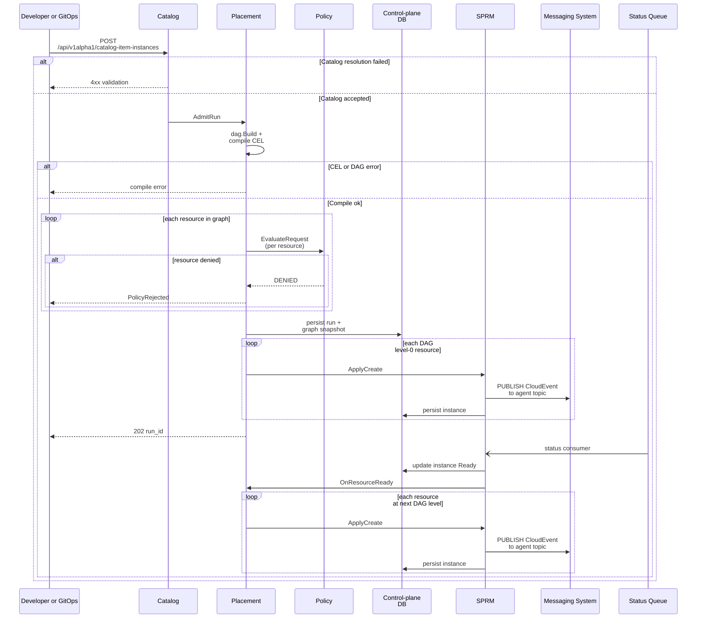

# Declarative API — Catalog and orchestration

## Summary

This proposal describes how DCM implements multi-tier (n-tier)
**catalog-backed** applications through a single declarative flow. A developer
submits a `CatalogItemInstance` (catalog item plus params); catalog resolution
produces an effective resource graph. This approach uses [CEL](https://cel.dev/)
for wiring values and a Direct Acyclic Graph (DAG) for dependency order and safe
parallelism on that graph.

## Motivation

Operators and platform teams need a declarative, multi-tier flow that combines
catalog governance (approved templates and constrained parameters) with
orchestration that can provision more than one related resource as part of a
single application request. **Current limitations**: Creating resources today is
oriented around one resource per request through catalog, placement, with policy
and provisioning invoked per call. There is no end-to-end flow defined for
allowing and processing multiple resources within a single request. **Why this
enhancement**: This proposal defines that flow for catalog-backed requests: how
resolution becomes an effective graph, how the platform runs policy on each
resource before provisioning, and how dependency order drives which resources
are created and when.

### Goals

- Define the mechanism for multi-tier **catalog item** instances (n-tier from
  catalog resolution).
- Define end-to-end flow for requesting an n-tier application from catalog to
  evaluate how CEL parser, DAG build, and policy work.
- Understand how declarative flow maps into `dcm-control-plane` packages
  (`internal/catalog`, `internal/placement`, `internal/policy`,
  `internal/serviceprovider`) behind `cmd/dcm-server`.

### Non-Goals

- Define the resource types, catalog items and DAG engine.
- Define state management for each resources within the Application.
- Choosing different environments per resource and validating network
  connectivity between them those resources (environment based placement and
  overlay connectivity).
- Graph-level (batch) policy evaluation in a single request with full-graph
  context for cross-resource rules (see Future improvements and Alternative 6).
- Freeform application submission without a catalog reference (see Future
  improvements and Alternative 5).

## Proposal

### Assumptions

- Each application run targets one placement context (no per-resource
  environment choice or cross-environment checks).
- Dependent resources are provisioned in DAG order only. Placement/Policy does
  not validate that assigned agents are network reachable across environments
  until environment based placement is introduced.

### Overview

The proposed solution is a single declarative graph (`spec.resources[]`) after
catalog resolution CEL (`${…}`) expresses values and cross-resource wiring; the
engine parses those expressions to infer dependencies alongside explicit
`requirements`. A DAG is built from that graph so the platform knows valid order
and safe parallelism (topological levels). Policy runs on the intended graph
before provisioning. Placement then walks the DAG, resolving CEL against outputs
as dependencies become ready.

### User Stories

#### Story — Request from catalog

A developer submits a catalog item instance that references a `CatalogItem` plus
params. The system loads the blueprint, merges params, resolves the catalog into
an effective resource graph, compiles CEL and the DAG. Then it evaluates policy
on each resource in the graph (all must pass before any `create`), befores
provisioning begins in DAG order. Afterward, it checks observable status until
terminal success or failure.

### Proposed System Architecture

#### Flow Description

1. User / GitOps → catalog package (`dcm-server`) User submits catalog-backed
   intent (`POST /api/v1alpha1/catalog-item-instances`). The catalog package
   resolves the blueprint and calls placement in-process with the effective
   graph.

2. internal/catalog → internal/placement On the catalog path, resolution turns
   blueprint plus params into `spec.resources[]`. Placement builds the DAG (CEL
   edges, topological levels), persists the run and graph snapshot in the
   platform database, and coordinates policy and apply.

3. internal/placement → internal/policy Placement calls the policy package once
   per resource in the resolved graph. Every resource must pass before any
   provisioning starts. Orchestration must not call SPRM until all per-resource
   evaluations succeed. Placement returns `202` and `run_id` after policy passes
   for the full resource set and creating for DAG level 0 resources have been
   initiated.

4. internal/placement → internal/serviceprovider After all resources pass
   policy, placement walks the DAG by level. For each resource at the current
   level (including resources that may run in parallel), placement calls the
   `internal/serviceprovider` to create the resources. Placement returns `202`
   and `run_id` after policy succeeds and level 0 `create` has been initiated.

5. internal/serviceprovider → Messaging System → Agent For each instance
   creation from placement, SPRM looks up the agent in the Agent Registry and
   publishes a creation CloudEvent to the agent's messaging topic. The Agent
   routes the request to the appropriate Service Provider. SPRM persists the
   service type instance in the control-plane database

6. status consumer → placement The status consumer updates instance rows in the
   control-plane database and notifies placement (in-process) when a dependency
   is in `Ready` state so placement can enqueue the next DAG level.

### Design Details

#### Sequence flow description

1. Developer or GitOps → catalog Submit catalog-backed intent
   (`POST /api/v1alpha1/catalog-item-instances`) with catalog item identity and
   user_values. Catalog Manager validates and persists the instance intent per
   its API contract.

2. Catalog → Placement Catalog resolves the blueprint and params into
   `spec.resources[]` and calls placement to admit the run.

3. Placement  
   This builds the DAG and compiles CEL and persists run and graph snapshot in
   the control-plane database.

4. Placement → Policy Placement calls policy once per resource in the resolved
   graph. Every resource must pass before any `create` is sent to SPRM. On any
   deny, return `PolicyRejected` with aggregated violations and do not call
   SPRM.

5. Placement → SPRM → Agent (level 0) For each resource at DAG level 0 (in
   parallel within the level when policy allows), placement calls SPRM. SPRM
   looks up the agent in the Agent Registry, publishes a creation CloudEvent to
   the agent's messaging topic, and persists the instance row. Placement returns
   `202` and `run_id` after policy succeeds and level-0 resources creation have
   been initiated.

6. Status-driven DAG progression (level 1 and above)  
   The SPRM status consumer receives events, updates instance state in the
   database, and notifies placement when dependencies are `Ready`. Placement
   calls SPRM again for each resource at the next DAG level. Later levels stay
   in run state until their dependencies are `Ready`.

#### CEL and DAG

`spec.resources[]` is treated as a graph of resources. CEL fills in values and
wires resources to each other (for example referencing another resource’s
outputs). A DAG (directed acyclic graph) captures dependencies so the platform
knows a valid order for provisioning and which resources may run in parallel at
the same step.

##### Dependency Edges

1. CEL expressions: References such as `${db.outputField}` imply an edge from
   `db` to the resource that uses the expression (the consumer depends on the
   producer’s output).
2. Explicit `requirements`: These are edges declared directly on a resource.
   That is, the resource must not be applied before its dependencies.

##### Executable Flow

1. Start from resolved `spec.resources[]` after catalog resolution.
2. Extract dependency pairs from CEL + `requirements` → build a directed graph
   (nodes = resources, edges = “must come before”).
3. Detect cycles; if any cycle exists, the graph is invalid for a linear
   provision order and should be rejected at compile time.
4. Topological sort → assign levels (layer 0 has no predecessors, layer _k_
   depends only on lower layers). Resources in the same level may be provisioned
   in parallel when policy allow.

##### Database Record Persistence

The whole graph, run state, provision jobs, and service type instances live in
one platform database so orchestration can be replayed, audited, and shown in
the UI. Catalog instances may reference `run_id`. Instance status used for
`Ready` checks is read from the same database after the status consumer updates
it.

##### Two-phase CEL

Treat CEL as two evaluation stages so nothing assumes a dependency output exists
before it really does. Before any create, resolve expressions that only need
params, literals, schema, and already known state (for example previously stored
ids or outputs). During or after each create, resolve expressions that reference
new outputs from dependencies as those values appear in state.

Workers for level _L_ must not start until state shows `Ready` (and required
output fields) for dependencies at _L−1_. Expressions that only use schema and
params can be evaluated earlier; expressions that need another resource’s
outputs stay deferred until that resource is `Ready`.

#### Policy evaluation

Evaluation uses the existing per-resource engine API.

1. Input per call: one resource's spec (map), plus catalog params snapshot as
   needed for mutation/defaulting.
2. Placement loops over every resource in the resolved graph at admission and
   calls evaluate once per resource. All must return APPROVED or MODIFIED with a
   selected agent before any SPRM `create`.
3. Output per resource: allow or deny, optional spec mutation, selected agent.
   Placement aggregates denials for the API response.

### Risks and Mitigations

| Risk                                                                       | Mitigation                                                                                                                 |
| -------------------------------------------------------------------------- | -------------------------------------------------------------------------------------------------------------------------- |
| Partial run after policy deny mid-loop                                     | Evaluate every resource at admission before any SPRM `create`; fail the run on first deny; do not apply partial approvals. |
| Cross-resource policy rules not expressible per resource                   | Document limitation; use catalog constraints until graph evaluate (Future improvements).                                   |
| DAG sort mutates internal graph                                            | Snapshot edges for policy and audit before topological ordering; rebuild if needed.                                        |
| Partial failure within a DAG level (some resources created, others failed) | Per-resource status on the run; mark run failed or compensating cleanup.                                                   |
| Admission blocked on level-0 Service Provider HTTP                         | Call SPRM only for level 0 at admission; bound HTTP timeouts; optional bounded parallelism within the level.               |
| Status consumer fails to notify placement                                  | Log and retry notification; periodic reconciliation of run state against instance rows.                                    |

## Drawbacks

- Per-resource policy at admission: N evaluate calls for N resources; some
  graph-wide rules cannot be enforced until graph-level evaluate exists.
- Level-0 apply runs on the admission path: admission waits for all per-resource
  policy evaluations plus in-process SPRM calls (Service Provider accept per
  resource), not for the entire graph to reach `RUNNING`.
- No durable provision outbox in the proposed flow: a crash after `202` may
  leave the run mid-level until reconciliation; a database-backed apply worker
  remains an optional later improvement.
- Placement carries orchestration complexity: DAG levels, per-resource loops,
  and in-process coordination with SPRM and the status consumer.

## Alternatives

### Alternative 1 — One NATS stream for both status and provision

#### Description

Use a single NATS stream (or subject hierarchy) for both message types: status
events from Service Providers (observed state, e.g. PENDING → RUNNING) and
provision commands from placement to SPRM (`create` work for graph resources).
Provisioning would reuse the same stream or subjects already used for provider
status reporting instead of a database provision outbox.

#### Pros

- Less messaging infrastructure to deploy and monitor at first (one stream to
  configure, one consumer pattern).
- Reuses an existing integration path that Service Providers already use for
  status updates.

#### Cons

- Commands and telemetry share one channel: Status traffic (high volume with
  many publishers) and provision commands (control-plane, low volume, strict
  ordering expectations) compete on the same stream.
- Schema and versioning are tied together: Changes to status event shape or
  provision payload format affect the same stream hence it is harder to evolve
  independently.
- Blast radius is larger: Misconfiguration, consumer bugs, or stream outages
  affect both observation (status) and action (provision), not one concern in
  isolation.

#### Status

Rejected

#### Rationale

Status ingestion and provisioning serve different roles: Status is high-volume,
with provider-originated telemetry. Provisioning is control plane commands with
stricter delivery and lifecycle needs. Separate streams or subjects keep
versioning, scaling, and failure domains independent.

### Alternative 2 — Interleaved policy and provision (incremental)

#### Description

Evaluate policy and start provisioning one resource at a time in graph order,
without first evaluating every resource in the graph at admission. For each
resource in DAG order, placement calls policy for that resource only; on
approval, it immediately calls SPRM to create that resource, then moves to the
next resource and repeats policy evaluation there.

#### Pros

- Resources at the front of the graph can start provisioning sooner, which may
  shorten the wait until the first resource begins provisioning, when policy is
  fast and graph-wide rules are simple or absent.
- Failures surface per resource as each step completes, which can feel more
  incremental to callers watching individual resources.

#### Cons

- Unsafe when policies depend on the whole graph. A resource approved and
  provisioned early may later be invalidated by rules that apply to the full
  application or to relationships between resources.
- Allows partial illegal graphs: some resources may reach SPRM or the provider
  before the run is rejected, requiring compensation, rollback, or cleanup.
- Graph-wide deny rules cannot be enforced atomically at admission; the caller
  may believe progress is valid while the run is ultimately invalid.
- Duplicates policy invocation and complicates run-level success criteria.

#### Status

Rejected

#### Rationale

The proposed flow evaluates every resource at admission (per-resource calls, all
must pass) before any SPRM `create`. Interleaved approve-then-provision allows
side effects before all resources are validated and conflicts with fail-fast
admission for n-tier catalog runs.

### Alternative 3 — SPRM as apply orchestrator (batch create)

#### Description

Placement returns immediately after policy by handing the full graph to SPRM.
SPRM checks dependencies in the control-plane database before each `create` and
retries or defers until dependencies are `Ready`. Placement does not walk DAG
levels or call SPRM per level; it does not receive `Ready` notifications to
trigger the next level.

#### Pros

- Placement admission is minimal after policy: no per-level loop at admission.
- Dependency waiting sits entirely in SPRM, next to instance status.

#### Cons

- SPRM must understand graph dependencies or carry rich metadata on each
  `create`, duplicating orchestration knowledge that otherwise lives in
  placement.
- Retry and defer logic risks duplicate creates, stuck applies, and harder
  debugging without strict idempotency and backoff.
- Expands SPRM beyond per instance create and status: it owns DAG progression,
  not placement.
- Resources at the same DAG level need consistent handling when dependencies
  become `Ready`, or some peers may starve while others retry.

#### Status

Rejected

#### Rationale

The proposed flow keeps DAG progression in placement: per-level in-process calls
to SPRM when a level is ready (level 0 at admission, later levels after the
status consumer notifies placement). SPRM remains a per-resource factory and
status sink, not the graph orchestrator.

### Alternative 4 — Database provision outbox and apply worker

#### Description

After policy, placement inserts one provision job row per resource (when that
DAG level is ready) into a control-plane table. A background worker in SPRM
claims jobs, calls Service Providers over HTTP, and updates instance rows.
Admission can return `202` as soon as jobs are persisted without waiting for
level-0 Service Provider HTTP on the request path.

#### Pros

- Durable `create`: survives process restart (retries and backoff on provider
  errors).
- Shorter admission path if returning `202` after job insert only.
- Clear separation between orchestration (placement writes jobs) and execution
  (worker claims jobs).

#### Cons

- Extra schema, worker lifecycle, and monitoring (stuck jobs, poison messages).
- Duplicates the in-process path unless one model is chosen; two ways to apply
  increases maintenance.
- Placement still must advance DAG levels when dependencies are `Ready`; worker
  alone does not replace placement orchestration without graph logic in SPRM
  (see Alternative 3).

#### Status

Considered

#### Rationale

The proposed flow keeps DAG progression in placement (enqueue per level when
dependencies are `Ready`, notified after the status consumer updates the
database) and limits SPRM to claiming jobs and executing `create`. Batch job
insert with worker-side requeue can simplify placement, but SPRM would own
ordering, retries, and graph-aware logic that placement already holds, adding
duplicated orchestration rules.

### Alternative 5 — Freeform application (no catalog reference)

#### Description

Allow developers to submit an application graph directly,`spec.resources[]`
authored without a `CatalogItem` reference instead of only catalog item
instances. The client would call a user-facing API on `dcm-server` (for example
`POST /api/v1alpha1/applications`). Catalog resolution is skipped; placement
receives the submitted graph and runs the same orchestration as the catalog path
(DAG compile, per-resource policy, per-level apply, status-driven progression).
May require RBAC and stronger governance because templates and parameter
constraints are not enforced by a published catalog item.

#### Pros

- Supports workloads that do not fit a pre-published catalog shape when policy
  allows ad hoc topologies.
- Reuses the same placement, policy, and SPRM flow once an effective graph
  exists; no second orchestration model.

#### Cons

- Weaker catalog governance: no blueprint approval path unless policy encodes
  equivalent rules.
- Entry API and auth model must be defined (who may submit freeform graphs).
- Catalog package is no longer the sole user-facing create path; documentation
  and UI must cover two submission modes.

#### Status

Deferred

#### Rationale

This enhancement focuses on catalog-backed n-tier flows
(`POST /api/v1alpha1/catalog-item-instances`). Freeform is deferred so
resolution, instance model, and catalog governance stay in scope first. The
orchestration contract defined here (graph, run, per-resource policy, DAG apply)
is intended to extend to freeform later without redesign if a separate submit
API is added.

### Alternative 6 — Graph-level policy evaluation

#### Description

Replace (or supplement) the per-resource evaluate loop with a single graph or
batch API: one request carrying full `resources[]`, dependency edges, and
optional platform context so OPA can approve or deny the run atomically and
assign coordinated providers across resources (for example dependent resources
that must land on compatible targets).

#### Pros

- One admission call for policy; clearer run-level allow or deny.
- Supports graph-wide and cross-resource Rego rules without N round-trips.
- Natural fit for coordinated provider or environment selection when that
  metadata is added to the evaluate payload.

#### Cons

- New engine API, input schema, and policy authoring model beyond today's
  `evaluateRequest` per resource.
- More complex OPA bundles and testing for graph rules.
- Does not remove the need for placement orchestration and DAG apply logic.

#### Status

Deferred

#### Rationale

This enhancement keeps per-resource evaluation to align with the v1 policy
engine and minimize new policy surface area. Graph-level evaluate is deferred as
a follow-on when cross-resource policy rules require it (see Future
improvements).

## Future improvements

Freeform submission and graph-level policy evaluation are intentionally deferred
until after catalog-backed n-tier flow and per-resource policy evaluation ship.

- Graph-level policy evaluation: single batch or `evaluateGraph` request with
  full `resources[]`, dependency edges, and optional environment or provider
  metadata so policy engine can enforce coordinated provider selection and
  graph-wide denies without N separate calls.
- Freeform applications: user-facing submit API for developer-authored
  `spec.resources[]` without a catalog reference (see Alternative 5).
