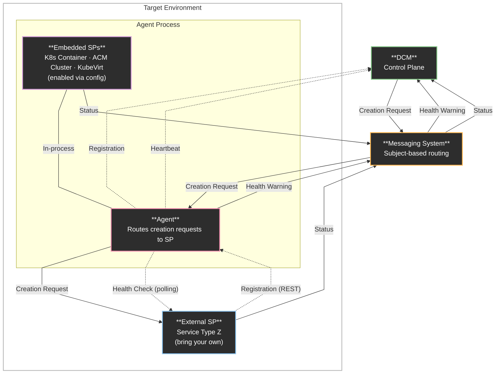
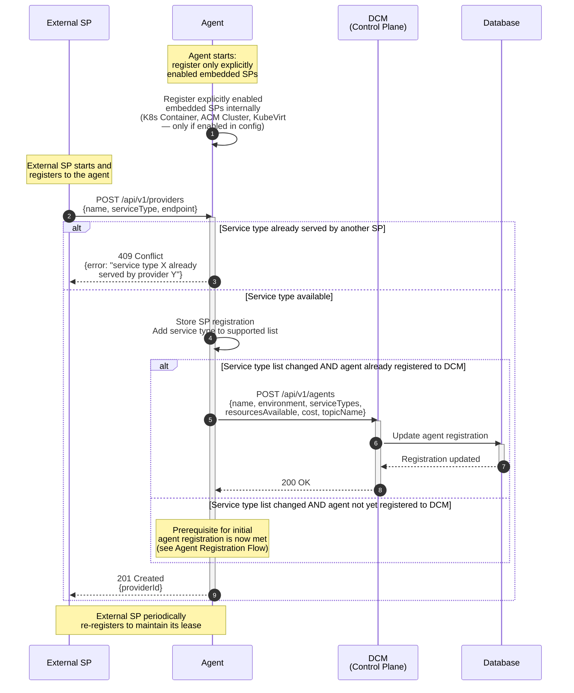
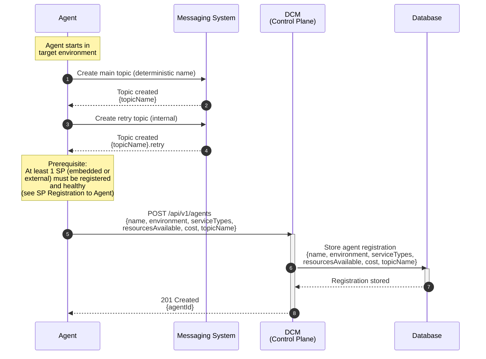
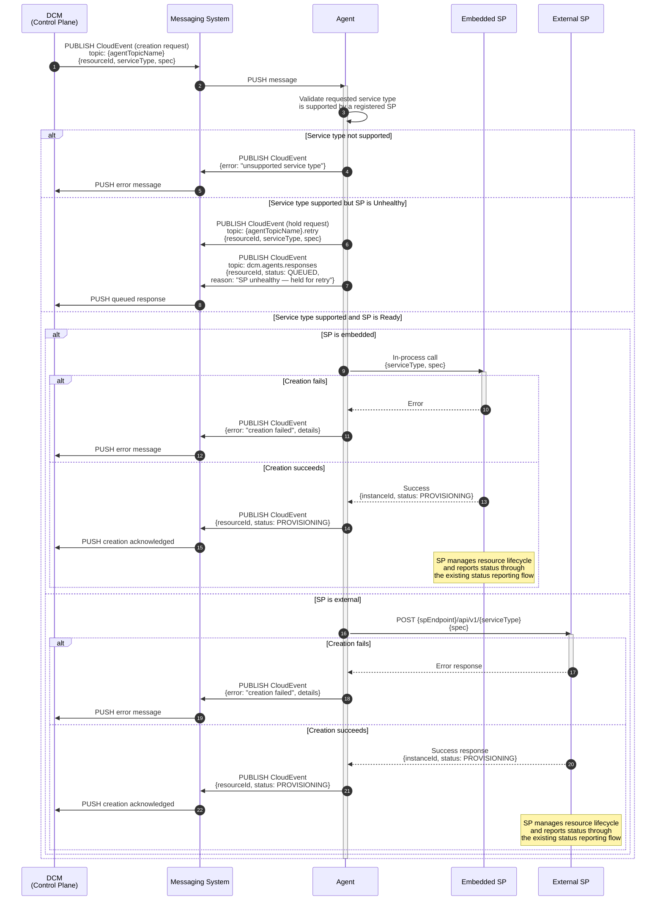
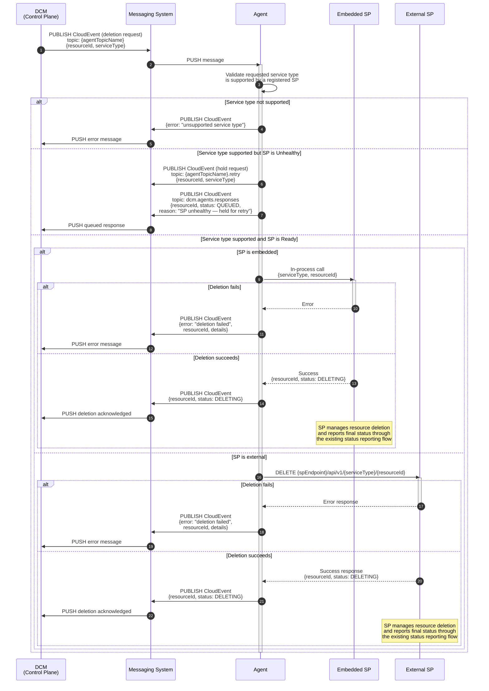
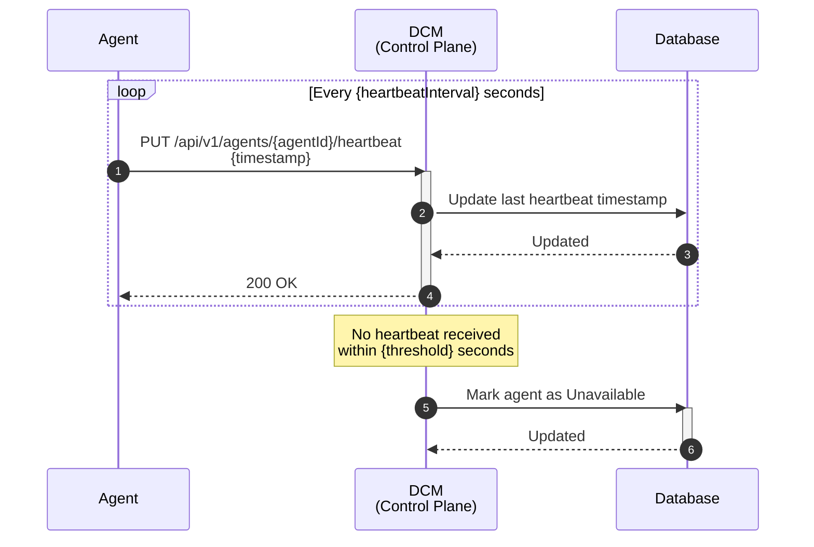
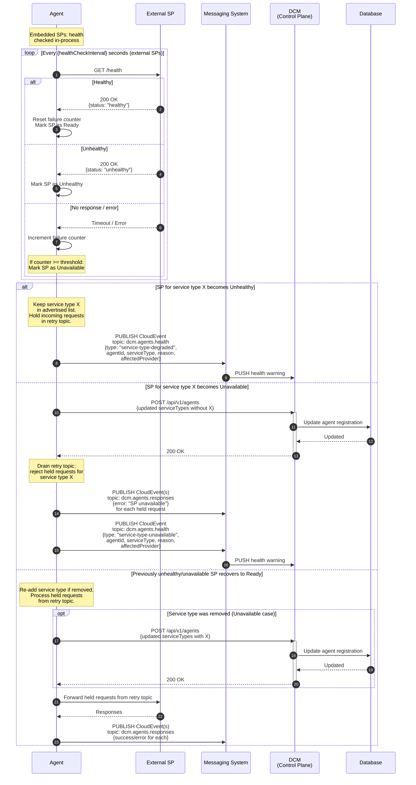

# Environment Agent

## Terminology

- **Agent:** A lightweight process that runs in a target environment, acting as
  the intermediary between DCM and the Service Providers deployed in that
  environment. It registers the environment to DCM, consumes resource operation
  requests from a messaging system, and routes them to the appropriate Service
  Provider.
- **Embedded SP:** SP code shipped within the agent binary (K8s Container, ACM
  Cluster, KubeVirt), enabled via configuration. Embedded SPs register
  internally at agent startup without a REST call.
- **External SP:** A standalone SP process that registers to the agent via the
  REST API (`POST /api/v1/providers`). Also referred to as "bring your own" SP.
- **Environment:** A set of infrastructures that is ready to receive workload
  from DCM (e.g., `dev`, `staging`, `prod-eu-west-1`).

## Summary

This enhancement aims at adding the notion of environment by adding a layer
between the SP and DCM: an agent would run on each environment usable by DCM and
the agent would register the environment to DCM.

The agent supports a hybrid SP model: it ships with embedded SP code for known
service types (K8s Container, ACM Cluster, KubeVirt), enabled via configuration,
and also accepts external ("bring your own") SPs that register via REST API.
Only one SP — embedded or external — may serve a given service type per agent;
duplicate registrations are rejected.

This enhancement also proposes to change the way the creation request is
submitted to the agent (or currently, to the SP): instead of sending a direct
request to the agent, DCM will send the request to a bus that will in turn be
consumed by the relevant agent to create the requested resource.

## Motivation

When deploying resources in general, one of the main criterion taken into
account is the type of environment in which the resource will be deployed: DEV,
INT, VAL, PROD, etc

Currently, in DCM, a resource's creation request is routed to a given Service
Provider (SP) by a policy on the base of several criteria. Once the SP is
selected, DCM will send a request to the selected SP to request the creation of
the resource.

There is currently no way for a policy to determine in which environment an SP
is running and hence a user cannot explicitly set the targeted environment
constraint when requesting the creation of a resource.

Furthermore, with the current way of submitting creation requests, the
administrator has to make sure the ports are open for DCM to reach the SP.
Changing how creation requests are consumed by giving the initiative to the
agent would solve this problem: the agent pulls work from a messaging system,
removing the need for DCM-to-environment inbound connectivity for creation
requests. The agent still requires outbound connectivity to DCM for registration
and heartbeats. This approach also aligns with the way K8s/OCP consume creation
requests, where manifests are pulled by the application creating the resource.

### Goals

- Define how the agent registers to DCM
- Define what information the agent gives to DCM while registering
- Define how agents and DCM are communicating
- Define how agents and Service Providers interact with each other
- Define how embedded SPs integrate with the agent alongside external SPs
  (hybrid model)
- Define the service type uniqueness constraint (one SP per service type)
- Define how Service Providers register to the agent, allowing the agent to
  dynamically build and maintain its list of supported service types
- Define how the agent monitors Service Provider health using the three-state
  health model (Ready, Unhealthy, Unavailable) and updates DCM when the
  supported service types change as a result
- Define how the agent reports its own health to DCM via periodic heartbeats

### Non-Goals

- Defining how to use the information registered by the agent to DCM
- Define how agent will provision application (vs simple service type)
- Update other enhancement files to reflect the changes introduced by the
  present document; this will be done in subsequent PRs.

## Proposal

### Overview

For each environment that can be used by DCM, an agent must be spawned. The
agent will self register to DCM. When doing so, it will provide, amongst other
information, the environment on which it's running and the service types it can
serve.

When starting, the agent will also create a specific topic in the messaging
system in order for DCM to communicate with the agent. The topic name is
deterministic — either derived from the agent's name or provided via
configuration — ensuring that after a restart the agent reuses the same topic.
If the topic already exists, the agent reuses it. The topic name is unique per
environment and is shared with DCM upon registration. In the current
single-agent model, one agent consumes from the topic. In a future HA model,
multiple agent replicas for the same environment could consume from the same
topic as competing consumers.

The agent supports a hybrid SP model combining embedded and external SPs:

- **Embedded SPs:** The agent ships with SP code for K8s Container, ACM Cluster,
  and KubeVirt. These are enabled via configuration and register internally at
  agent startup — no REST call is needed. The embedded SP code lives in
  dedicated packages within the agent codebase.
- **External SPs ("bring your own"):** Standalone SP processes register to the
  agent via the REST API (`POST /api/v1/providers`), following the contract
  defined in the
  [SP Registration Flow](../sp-registration-flow/sp-registration-flow.md).

Only one SP — embedded or external — may serve a given service type per agent.
If an SP attempts to register for a service type that is already served, the
registration is rejected (see
[SP Registration to Agent](#sp-registration-to-agent)). Future iterations may
support multiple SPs per service type with selection strategies (e.g.,
affinity-based, capacity-based).

The agent dynamically builds its list of supported service types based on the
SPs registered to it (both embedded and external). When the list changes (SP
registration or health-driven removal), the agent updates DCM accordingly.

An agent must have at least one SP (embedded or external) registered and healthy
before self registering to DCM. Each service type advertised to DCM must be
backed by a healthy SP.

DCM will send the creation request to the specific topic that was created by the
agent.

The agent will then consume the message, validate it and then pass it to the
relevant SP.

The agent monitors the health of its registered SPs using the three-state model
(Ready, Unhealthy, Unavailable). The health monitoring mechanism differs by SP
type:

- **Embedded SPs:** Health is determined in-process — the agent directly checks
  the embedded SP's internal state without a network call.
- **External SPs:** Health is determined by polling the SP's `GET /health`
  endpoint, as defined in the
  [Service Provider Health Check enhancement](../service-provider-health-check/service-provider-health-check.md).

The agent differentiates its behavior based on the SP health state:

- **Unhealthy:** The agent keeps the service type in its advertised list to DCM
  but stops routing requests to the SP. Incoming requests for that service type
  are held in a dedicated retry topic until the SP recovers or becomes
  unavailable.
- **Unavailable:** The agent removes the service type from its advertised list,
  updates DCM, and rejects any held requests for that service type.

The agent exposes the health status of each registered SP via a `/api/v1/status`
endpoint. On Kubernetes/OpenShift deployments, the agent additionally surfaces
this information as custom pod conditions on its own pod, allowing
administrators to quickly identify which SPs are causing issues via
`oc describe pod`.

The agent reports its own liveness to DCM via periodic REST heartbeats. DCM
tracks the last heartbeat timestamp and marks the agent as unavailable if no
heartbeat is received within a configurable threshold.

The status monitoring will not be impacted: the SP will be the one managing the
resource and the current flow will remain the same; the agent is only an
intermediary.

### Architecture



#### Flow Description

- The agent is spawned in an environment
- At startup, the agent registers its configured embedded SPs internally (K8s
  Container, ACM Cluster, KubeVirt — each enabled via configuration)
- External SPs register to the agent via REST API; the agent rejects
  registration if the service type is already served (by an embedded or another
  external SP)
- Only one SP (embedded or external) may serve a given service type
- The agent creates a specific topic in the bus system
- Once at least one SP is registered and healthy, the agent self-registers to
  DCM and begins sending periodic heartbeats
- DCM sends creation request to the specific topic
- The agent consumes the messages sent to the topic
- The agent routes the creation request to the SP serving the requested service
  type
- The agent monitors each registered SP's health: in-process for embedded SPs,
  via `/health` endpoint polling for external SPs. When the SP for a service
  type becomes unhealthy, the agent publishes a health warning through the
  messaging system
- The status monitoring remains unchanged: each SP manages its resource
  lifecycle and reports status through the messaging system

### API

#### Agent Endpoints

| Method | Endpoint          | Description                                                                                                   |
| ------ | ----------------- | ------------------------------------------------------------------------------------------------------------- |
| POST   | /api/v1/providers | SP registration — reuses the [SP Registration Flow](../sp-registration-flow/sp-registration-flow.md) contract |
| GET    | /api/v1/status    | Agent status — health of all registered SPs                                                                   |

##### `POST /api/v1/providers` — SP Registration (External SPs only)

Reuses the contract defined in the
[SP Registration Flow](../sp-registration-flow/sp-registration-flow.md)
enhancement. The agent applies the same idempotency semantics (name as natural
key, create-or-update behavior).

Only one SP may serve a given service type. If the requested service type is
already served by another SP (embedded or external), the agent rejects the
registration with `409 Conflict`:

```json
{
  "error": "service type 'vm' is already served by provider 'vm-provider'"
}
```

Embedded SPs register internally at startup and do not use this endpoint.

##### `GET /api/v1/status` — Agent Status

Returns the health state of all registered SPs (both embedded and external).
This endpoint is always available, regardless of the deployment mode
(Kubernetes, Docker, standalone), and is the primary way to inspect the agent's
view of its Service Providers.

Example response:

```json
{
  "providers": [
    {
      "providerId": "sp-container-001",
      "name": "k8s-container",
      "serviceType": "container",
      "type": "embedded",
      "status": "Ready",
      "lastCheck": "2026-06-05T10:30:00Z"
    },
    {
      "providerId": "sp-db-001",
      "name": "db-provider",
      "serviceType": "database",
      "type": "external",
      "status": "Unhealthy",
      "lastCheck": "2026-06-05T10:30:00Z"
    }
  ]
}
```

#### DCM Endpoints

| Method | Endpoint                           | Description        |
| ------ | ---------------------------------- | ------------------ |
| POST   | /api/v1/agents                     | Agent registration |
| PUT    | /api/v1/agents/{agentId}/heartbeat | Agent heartbeat    |

##### `POST /api/v1/agents` — Agent Registration

Register a new agent to DCM.

| Field              | Type     | Required | Description                                                                                                                                                                                                                                                                                                                              |
| ------------------ | -------- | -------- | ---------------------------------------------------------------------------------------------------------------------------------------------------------------------------------------------------------------------------------------------------------------------------------------------------------------------------------------- |
| name               | string   | yes      | Unique agent name                                                                                                                                                                                                                                                                                                                        |
| environment        | string   | yes      | Freeform environment identifier (e.g., `"dev"`, `"staging"`, `"prod-eu-west-1"`)                                                                                                                                                                                                                                                         |
| serviceTypes       | string[] | yes      | List of service types the agent can serve. Must be non-empty on initial registration (prerequisite: at least one healthy SP, embedded or external). May be empty on subsequent re-registrations when SPs become unavailable (an Unhealthy SP does not trigger service type removal — see [SP Health Monitoring](#sp-health-monitoring)). |
| resourcesAvailable | object   | no       | Available resources in the environment — sourced from K8s node info or manual configuration (see below)                                                                                                                                                                                                                                  |
| cost               | enum     | yes      | Cost tier: `low` \| `medium-low` \| `medium` \| `medium-high` \| `high`                                                                                                                                                                                                                                                                  |
| topicName          | string   | yes      | Deterministic topic name for the agent's messaging channel                                                                                                                                                                                                                                                                               |

Response: `201 Created` with `{agentId}`

###### `resourcesAvailable` Structure

The `resourcesAvailable` field is optional. When provided, it follows a similar
structure to the SP registration metadata defined in the
[SP Registration Flow](../sp-registration-flow/sp-registration-flow.md), but
represents the aggregate available resources across the environment rather than
a single SP's capacity.

Example:

```json
{
  "totalCpu": 200,
  "totalMemory": "1TB",
  "totalStorage": "2TB",
  "totalNode": 100
}
```

##### `PUT /api/v1/agents/{agentId}/heartbeat` — Agent Heartbeat

| Field     | Type              | Required | Description               |
| --------- | ----------------- | -------- | ------------------------- |
| timestamp | string (ISO 8601) | yes      | Agent's current timestamp |

Response: `200 OK`

### SP Registration to Agent

Service Providers register to the agent rather than to DCM directly. The agent
supports two registration mechanisms and dynamically maintains its list of
supported service types based on registered SPs.

**Service type uniqueness constraint:** Only one SP — embedded or external — may
serve a given service type per agent. The first SP to register for a service
type claims the slot. Subsequent registration attempts for the same service type
are rejected.

#### Embedded SP Registration

Embedded SPs are not active by default. An administrator must explicitly enable
each embedded SP in the agent's configuration file. At startup, the agent
registers only the embedded SPs that are explicitly enabled in its
configuration. Each embedded SP's code lives in a dedicated package within the
agent codebase. The embedded SP code reaches the agent's registration logic
directly — no REST call is involved.

If the agent restarts with a configuration change that newly enables an embedded
SP for a service type already occupied by an external SP (registered during a
prior session and still holding its slot), the embedded SP registration for that
service type is skipped. The agent logs a warning and continues starting
normally — this is not a fatal error. The external SP retains its slot until it
is explicitly deregistered or its lease expires.

Because embedded SPs register at startup before external SPs can connect, they
effectively take priority on a clean agent state.

#### External SP Registration

External SPs register via the REST API (`POST /api/v1/providers`), following the
contract defined in the
[SP Registration Flow](../sp-registration-flow/sp-registration-flow.md)
enhancement. The agent applies the same idempotency semantics (name as natural
key, create-or-update behavior).

If the requested service type is already served by another SP (embedded or
external), the agent rejects the registration with `409 Conflict` and a message
identifying the conflicting provider, so the administrator can take action if
necessary.

External SPs periodically re-register with the agent to maintain their
registration. This periodic re-registration serves as a lease renewal and
ensures that after an agent restart (where the agent loses its in-memory state),
SPs naturally re-register without requiring any additional coordination
mechanism.

#### DCM Notification on Service Type Change

When the list of supported service types changes as a result of an SP
registration (embedded or external) and the agent is already registered to DCM,
the agent updates DCM via a `POST /api/v1/agents` request with the full updated
registration payload. If the agent has not yet registered to DCM (i.e., this is
the first SP registering), the agent does not notify DCM yet; instead, the SP
registration satisfies the prerequisite for the agent to proceed with its
initial registration to DCM (see
[Agent Registration Flow](#agent-registration-flow)).

#### SP Registration Flow

The following diagram illustrates the complete SP registration flow, including
embedded SP startup, external SP registration, conflict handling, and DCM
notification:



#### Flow Description

1. At startup, the agent registers only the embedded SPs that are explicitly
   enabled in its configuration. Embedded SPs are not active by default — an
   administrator must opt in via the agent's configuration file. Each enabled
   embedded SP claims a service type slot. If a slot is already occupied (e.g.,
   by an external SP that persisted from a prior session), the agent logs a
   warning and continues without registering that embedded SP
2. An external SP starts and registers to the agent via
   `POST /api/v1/providers`, providing:
   - Name
   - Service type it serves
   - Endpoint (URL where the agent can reach the SP)
3. The agent checks whether the requested service type is already served:
   - If **already served**: the agent rejects the registration with
     `409 Conflict` and a message identifying the conflicting provider
   - If **available**: the agent stores the SP registration and adds the service
     type to its supported list
4. If the service type list changed (new service type added), the agent notifies
   the DCM Control Plane by sending `POST /api/v1/agents` with the full updated
   agent registration (name, environment, supported service types, available
   resources, cost, topic name); the DCM Control Plane updates the agent record
   in the database and responds with `200 OK`. If the agent is not yet
   registered to the DCM Control Plane, this step is deferred — the SP
   registration instead satisfies the prerequisite for the agent's initial
   registration (see [Agent Registration Flow](#agent-registration-flow))
5. The agent acknowledges the SP registration
6. External SPs periodically re-register with the agent; the agent handles this
   idempotently (create or update). This ensures that after an agent restart,
   external SPs naturally rebuild the agent's state without additional
   coordination

### Agent Registration Flow



#### Flow Description

1. The agent starts and serves a specific environment
2. The agent creates two topics in the messaging system:
   - A **main topic** (using a deterministic name) to establish a dedicated
     communication channel with DCM. This topic name is advertised to DCM during
     registration.
   - A **retry topic** (`{topicName}.retry`) used internally by the agent to
     hold requests when the SP for a service type is Unhealthy (see
     [Retry Topic](#retry-topic)). This topic is not advertised to DCM.
3. The agent checks whether at least one SP (embedded or external) is registered
   and healthy:
   - If at least one SP is registered and healthy: the agent proceeds to
     register to DCM
   - Else: the agent waits until at least one SP is registered and healthy
4. The agent registers itself with DCM via a REST API call, providing:
   - Name
   - Environment
   - Supported service types
   - Available resources
   - Cost tier
   - Topic name
5. DCM persists the registration in the database
6. DCM acknowledges the registration

#### Re-Registration on Restart

When the agent restarts, it uses the same `POST /api/v1/agents` endpoint with
the same payload. The agent does not persist its `agentId`; it relies on DCM's
idempotent registration, which uses the agent `name` as the natural key (same
pattern as SP registration defined in the
[SP Registration Flow](../sp-registration-flow/sp-registration-flow.md)): if the
name already exists and no `agentId` is provided (or the same `agentId` is
provided), DCM updates the existing entry, returns the same `agentId`, and
resets the heartbeat tracker. The agent then uses the returned `agentId` for
subsequent heartbeats and updates.

Ensuring that each agent uses a unique name is an operational responsibility.

Note that the `(name, topicName)` pair is not unique: in a future HA model,
multiple agent replicas for the same environment may share the same topic name.

### Resource Creation Flow



#### Flow Description

1. DCM publishes a creation request CloudEvent to the agent's dedicated topic in
   the messaging system, including the resource ID, service type, and spec
2. The agent consumes the message
3. The agent validates that the requested service type is supported by a
   registered SP (embedded or external)
4. If the service type is **not supported**:
   - The agent publishes an error CloudEvent back to the messaging system
   - DCM consumes the error message
5. If the service type is **supported but the SP is Unhealthy**:
   - The agent publishes the original request CloudEvent to the retry topic
     (`{agentTopicName}.retry`) for durable holding
   - The agent publishes a "queued" CloudEvent to `dcm.agents.responses` with
     `{resourceId, serviceType, status: "QUEUED"}`, informing DCM that the
     request is held for retry
   - The request will be processed when the SP recovers, or rejected if the SP
     becomes Unavailable (see [Retry Topic](#retry-topic))
6. If the service type is **supported and the SP is Ready**:
   - The agent forwards the creation request to the SP via REST API (for
     external SPs) or in-process call (for embedded SPs)
   - If the SP returns an **immediate error**: the agent publishes an error
     CloudEvent back to the messaging system for DCM to consume
   - If the SP **accepts** the request: the agent publishes a CloudEvent
     acknowledging the creation is in progress. The SP takes over resource
     lifecycle management and reports status changes through the existing status
     reporting flow (SP → Messaging System → DCM)

#### Service Type Uniqueness

Each service type is served by exactly one SP (embedded or external). There is
no SP selection strategy in the current version. Future iterations may support
multiple SPs per service type with selection strategies (e.g., affinity-based,
capacity-based).

#### Retry Policy

When the agent forwards a creation request to an SP and the SP returns an error,
the agent applies a configurable retry policy. When retries are exhausted, the
agent publishes an error CloudEvent to the messaging system with the resource ID
(provided by DCM in the original creation request), allowing DCM to track the
failure.

#### Retry Topic

When the SP for a given service type is Unhealthy, the agent cannot route
requests but the service type remains advertised to DCM (to avoid registration
flapping). Instead of rejecting the request, the agent publishes it to a
dedicated **retry topic** (`{agentTopicName}.retry`) for durable holding, and
responds to DCM with a "queued" CloudEvent.

The retry topic is created by the agent at startup alongside the main topic (see
[Agent Registration Flow](#agent-registration-flow)). It is internal to the
agent and is not advertised to DCM.

**Message format:** The original CloudEvent is published to the retry topic
as-is (passthrough, no wrapping).

**Consumption is event-driven.** The agent reads the retry topic only when an SP
health state changes — not periodically:

- **SP transitions to Ready:** The agent consumes the retry topic. For each
  message whose service type now has a Ready SP, the agent processes the request
  (forwards to the SP, responds to DCM with success or error). Messages for
  service types whose SP is still Unhealthy are re-published to the retry topic.
- **SP transitions to Unavailable:** The agent consumes the retry topic. For
  each message whose service type's SP is Unavailable, the agent rejects the
  request with an error CloudEvent to DCM. Messages for other service types are
  re-published to the retry topic.
- **No health state change:** The retry topic is not consumed.

**Creation/Deletion dedup:** If both a creation request and a deletion request
for the same resource ID are present in the retry topic, both messages are
removed — they cancel out since the resource was never created. The agent logs
the cancellation and acknowledges the deletion to DCM. The creation request is
silently dropped since it was never started.

**Ordering:** Requests are processed in arrival order per service type. Requests
for different service types are independent.

**Durability:** Messages in the retry topic survive agent crashes, guaranteed by
the messaging system's persistence layer. On restart, the agent re-reads both
the main topic and the retry topic.

#### In-Flight Request Handling

When the agent restarts, unconsumed messages on both the main topic and the
retry topic are consumed once the agent is back up (guaranteed by the messaging
system's persistence layer).

- **SP is Unhealthy:** The agent publishes the request to the retry topic and
  responds to DCM with a "queued" CloudEvent. The request is processed when the
  SP recovers, or rejected when the SP for that service type becomes Unavailable
  (see [Retry Topic](#retry-topic)).
- **SP is Unavailable:** The agent responds with an error CloudEvent for each
  incoming request targeting that service type. Additionally, the agent drains
  the retry topic, rejecting any held requests for that service type with error
  CloudEvents.

### Resource Deletion Flow



#### Flow Description

1. DCM publishes a deletion request CloudEvent to the agent's dedicated topic in
   the messaging system, including the resource ID and service type
2. The agent consumes the message
3. The agent validates that the requested service type is supported by a
   registered SP (embedded or external)
4. If the service type is **not supported**:
   - The agent publishes an error CloudEvent back to the messaging system
   - DCM consumes the error message
5. If the service type is **supported but the SP is Unhealthy**:
   - The agent publishes the original request to the retry topic for durable
     holding
   - The agent publishes a "queued" CloudEvent to `dcm.agents.responses`,
     informing DCM that the request is held for retry
   - The request will be processed when the SP recovers, or rejected if the SP
     becomes Unavailable (see [Retry Topic](#retry-topic))
6. If the service type is **supported and the SP is Ready**:
   - The agent forwards the deletion request to the SP via a REST `DELETE` call
     (for external SPs) or in-process call (for embedded SPs)
   - If the SP returns an **immediate error**: the agent publishes an error
     CloudEvent back to the messaging system for DCM to consume
   - If the SP **accepts** the request: the agent publishes a CloudEvent
     acknowledging the deletion is in progress. The SP manages the actual
     resource deletion and reports the final status through the existing status
     reporting flow (SP → Messaging System → DCM)

The retry policy and in-flight request handling described in the
[Resource Creation Flow](#resource-creation-flow) apply equally to deletion
requests.

### Health

#### Agent Health

The agent reports its own liveness to DCM via periodic REST heartbeats. Since
the messaging system is used for resource operations (creation requests, status
updates), the heartbeat uses the existing REST channel that the agent already
uses for registration.

DCM tracks the last heartbeat timestamp for each agent. If no heartbeat is
received within a configurable threshold, DCM marks the agent as unavailable.

On startup, the agent registers to DCM (as described in
[Agent Registration Flow](#agent-registration-flow)). If the agent restarts, it
re-registers to DCM; DCM handles this idempotently, resetting the heartbeat
tracker.



##### Flow Description

1. The agent periodically sends a heartbeat to DCM via a REST `PUT` call
2. DCM updates the agent's last heartbeat timestamp in the database
3. If DCM does not receive a heartbeat within the configured threshold, it marks
   the agent as **Unavailable**
4. When the agent restarts, its initial registration to DCM resets the heartbeat
   tracker and the agent status

#### SP Health Monitoring

The agent monitors the health of its registered Service Providers using the
three-state health model defined in the
[Service Provider Health Check enhancement](../service-provider-health-check/service-provider-health-check.md).
The monitoring mechanism differs by SP type:

- **Embedded SPs:** Health is determined in-process — the agent directly checks
  the embedded SP's internal state without a network call.
- **External SPs:** Health is determined by polling the SP's `GET /health`
  endpoint.

| State           | Condition                                                                                                                                  |
| --------------- | ------------------------------------------------------------------------------------------------------------------------------------------ |
| **Ready**       | SP responds with `200 OK` and `status: "healthy"` (external), or internal check passes (embedded)                                          |
| **Unhealthy**   | SP responds with `200 OK` and `status: "unhealthy"` (external), or internal check reports unhealthy (embedded)                             |
| **Unavailable** | SP does not respond or returns an error after exceeding the failure threshold (external), or internal check reports unavailable (embedded) |

With the agent layer, the responsibility for monitoring SP health shifts from
DCM to the agent. The agent is the natural point to perform health checks on its
registered SPs, as it already maintains the list of SP registrations.

The agent only routes requests to SPs in the **Ready** state. An SP in the
**Unhealthy** or **Unavailable** state is not eligible for routing, even though
an Unhealthy SP may be technically reachable. When the SP for a service type is
Unhealthy, incoming requests are held in the retry topic rather than rejected
(see [Retry Topic](#retry-topic)).

Since each service type is served by exactly one SP, the agent's behavior is
determined by that SP's health state:

**When the SP becomes Unhealthy:**

1. The agent **keeps** the service type in its advertised list (no update sent
   to DCM to remove it)
2. The agent stops routing new requests for that service type — incoming
   requests are held in the retry topic and a "queued" CloudEvent is sent to DCM
3. The agent publishes a health warning CloudEvent to `dcm.agents.health` with
   type `service-type-degraded`

**When the SP becomes Unavailable:**

1. The agent removes the service type from its advertised list
2. The agent sends a `POST /api/v1/agents` request to DCM with the updated
   registration (service types list without the affected type)
3. The agent drains the retry topic: all held requests for that service type are
   rejected with error CloudEvents to DCM
4. The agent publishes a health warning CloudEvent to `dcm.agents.health` with
   type `service-type-unavailable`

**When a previously unhealthy or unavailable SP recovers** (returns to Ready
state):

1. If the service type was removed (Unavailable case): the agent re-adds it to
   its list and sends a `POST /api/v1/agents` to DCM with the updated
   registration
2. The agent processes held requests from the retry topic for that service type
   (see [Retry Topic](#retry-topic))

##### Agent Status

The agent exposes the health status of all registered SPs via the
`GET /api/v1/status` endpoint (see
[Agent Endpoints — `GET /api/v1/status`](#get-apiv1status--agent-status) for the
response format).

##### Pod Conditions (Kubernetes / OpenShift)

On Kubernetes or OpenShift deployments, the agent additionally exposes the
health status of each registered SP as custom pod conditions on its own pod.
This complements the `/api/v1/status` endpoint and allows administrators to
inspect the agent's pod (e.g., via `oc describe pod`) and immediately see which
SPs are healthy, unhealthy, or unavailable without having to query the agent's
REST API.

Each registered SP is represented as a separate pod condition, using the SP's
provider ID as the condition type. The condition's `status` field reflects
whether the SP is healthy (`True`) or not (`False`), and the `reason` and
`message` fields provide additional context.

Example output from `oc describe pod <agent-pod>`:

```
Conditions:
  Type                         Status  Reason       Message
  sp-vm-001/vm                 True    Ready        SP vm-provider serving service type vm is healthy
  sp-db-001/database           False   Unhealthy    SP db-provider serving service type database is unhealthy
```

###### Implementation Detail

The agent uses
[Pod Readiness Gates](https://kubernetes.io/docs/concepts/workloads/pods/pod-lifecycle/#pod-readiness-gate)
to surface per-SP health as custom pod conditions. The agent's pod spec declares
a readiness gate for each expected condition type, and the agent application
patches its own pod's `status.conditions` via the Kubernetes API using
in-cluster authentication (`rest.InClusterConfig()` or equivalent). This
requires RBAC permissions on the `pods/status` subresource for the agent's
service account.



##### Flow Description

1. The agent monitors each registered SP's health:
   - **Embedded SPs:** health checked in-process (no network call)
   - **External SPs:** health checked by periodically polling `GET /health`
2. Based on the result, the agent updates the SP's health state:
   - Healthy → **Ready** (failure counter reset)
   - Unhealthy → **Unhealthy**
   - Timeout or error (external) / internal failure (embedded) → increment
     failure counter; if counter exceeds threshold → **Unavailable**
3. When the SP for a service type becomes **Unhealthy**:
   - The agent **keeps** the service type in its advertised list (no update sent
     to DCM)
   - Incoming requests for that service type are held in the retry topic (see
     [Retry Topic](#retry-topic))
   - The agent publishes a `service-type-degraded` health warning CloudEvent to
     the `dcm.agents.health` topic
4. When the SP for a service type becomes **Unavailable**:
   - The agent removes the service type from its advertised list
   - The agent sends a `POST /api/v1/agents` to DCM with the updated
     registration
   - The agent drains the retry topic: all held requests for that service type
     are rejected with error CloudEvents to DCM
   - The agent publishes a `service-type-unavailable` health warning CloudEvent
     to the `dcm.agents.health` topic
5. When a previously unhealthy or unavailable SP recovers:
   - If the service type was removed (Unavailable case): the agent re-adds it to
     its list and sends a `POST /api/v1/agents` to DCM with the updated
     registration
   - The agent processes held requests from the retry topic for that service
     type
6. The agent exposes the health status of all registered SPs (both embedded and
   external) via the `GET /api/v1/status` endpoint. On Kubernetes/OpenShift
   deployments, the agent additionally surfaces this information as custom pod
   conditions on its own pod (see
   [Pod Conditions](#pod-conditions-kubernetes--openshift))

### CloudEvent Message Definitions

All messages exchanged through the messaging system use the
[CloudEvents v1.0](https://github.com/cloudevents/spec/blob/v1.0.2/cloudevents/spec.md)
specification, following the conventions established in the
[Service Provider Status Reporting](../state-management/service-provider-status-reporting.md)
enhancement.

All agent-originated CloudEvents include `agentName` and `topicName` in the data
payload for correlation, in addition to the `source` envelope attribute. This
allows DCM to identify both the resource and the originating agent when
consuming from the shared `dcm.agents.responses` subject.

The `spec` field in creation request data follows the schema defined by the
target service type (see
[SP Resource Manager](../sp-resource-manager/sp-resource-manager.md),
[Placement Manager](../placement-manager/placement-manager.md)).

| Message               | `type`                                      | `source`               | `subject`              | `data`                                                                   |
| --------------------- | ------------------------------------------- | ---------------------- | ---------------------- | ------------------------------------------------------------------------ |
| Creation Request      | `dcm.request.create`                        | `dcm/control-plane`    | `{agentTopicName}`     | `{resourceId, serviceType, spec}`                                        |
| Deletion Request      | `dcm.request.delete`                        | `dcm/control-plane`    | `{agentTopicName}`     | `{resourceId, serviceType}`                                              |
| Creation Acknowledged | `dcm.agent.creation-acknowledged`           | `dcm/agents/{agentId}` | `dcm.agents.responses` | `{resourceId, agentName, topicName, status: "PROVISIONING"}`             |
| Deletion Acknowledged | `dcm.agent.deletion-acknowledged`           | `dcm/agents/{agentId}` | `dcm.agents.responses` | `{resourceId, agentName, topicName, status: "DELETING"}`                 |
| Request Queued        | `dcm.agent.request-queued`                  | `dcm/agents/{agentId}` | `dcm.agents.responses` | `{resourceId, agentName, topicName, serviceType, status: "QUEUED"}`      |
| Error                 | `dcm.agent.error`                           | `dcm/agents/{agentId}` | `dcm.agents.responses` | `{resourceId, agentName, topicName, error, details}`                     |
| Health Degraded       | `dcm.agent.health.service-type-degraded`    | `dcm/agents/{agentId}` | `dcm.agents.health`    | `{agentId, agentName, topicName, serviceType, reason, affectedProvider}` |
| Health Unavailable    | `dcm.agent.health.service-type-unavailable` | `dcm/agents/{agentId}` | `dcm.agents.health`    | `{agentId, agentName, topicName, serviceType, reason, affectedProvider}` |

### Assumptions

- A messaging system (e.g., NATS) is deployed and accessible to both DCM and the
  agent
- The agent has outbound network connectivity to DCM's REST API (for
  registration and heartbeats)
- External SPs have network connectivity to the agent's REST API (for
  registration and health checks)
- For Kubernetes/OpenShift deployments: the agent's service account has RBAC
  permissions for the `pods/status` subresource

### Risks and Mitigations

| Risk                                                           | Mitigation                                                                                                                                                                                                                                                                                                                                                 |
| -------------------------------------------------------------- | ---------------------------------------------------------------------------------------------------------------------------------------------------------------------------------------------------------------------------------------------------------------------------------------------------------------------------------------------------------- |
| Agent is a single point of failure per environment             | Deferred to HA iteration. Agent restart recovers state: embedded SPs register internally at startup; external SPs periodically re-register, naturally rebuilding the agent's state.                                                                                                                                                                        |
| Messaging system failure blocks creation requests              | Dependent on chosen bus technology's delivery guarantees. Stated as an assumption.                                                                                                                                                                                                                                                                         |
| Message loss with at-most-once semantics                       | Rely on bus capabilities (e.g., JetStream for NATS). Specific delivery guarantee is a deployment decision.                                                                                                                                                                                                                                                 |
| Split-brain: agent loses DCM connectivity but keeps processing | On reconnection, the agent re-registers to DCM. During the split, DCM marks the agent as unavailable and stops routing new requests to its topic. In-flight messages are processed normally. Duplicate creation risk if DCM re-routes to another agent is mitigated by idempotent resource creation (resource ID provided by DCM in the creation request). |
| Unauthenticated external SP registration                       | Deferred to AuthN/Z iteration. Network isolation is the interim mitigation.                                                                                                                                                                                                                                                                                |
| Embedded SP crash takes down the agent                         | Embedded SPs run in-process; a panic/crash affects the entire agent. Mitigation: embedded SP code is well-tested and isolated in dedicated packages. Process-level restart recovers state via re-registration.                                                                                                                                             |

## Drawbacks

- Adds operational complexity: a new binary (the agent) must be deployed,
  configured, and monitored per environment
- Adds latency to the creation path: DCM → messaging system → agent → SP, versus
  the current DCM → SP direct call
- Fragments health monitoring responsibility: DCM monitors agent health via
  heartbeats, while the agent monitors SP health directly (in-process for
  embedded SPs, via polling for external SPs)
- Requires messaging system infrastructure accessible to both DCM and all target
  environments
- Embedding SP code (K8s Container, ACM Cluster, KubeVirt) increases agent
  binary size and couples the agent release cycle to the embedded SPs for
  updates

## Alternatives

### Alternative 1: Watch / Reconcile Pattern

#### Description

Instead of using a messaging system for creation requests, DCM would expose
resource requests through its own API. The agent would poll DCM's API or be
notified by DCM of new events, discover pending resource requests targeting its
environment, and reconcile them by forwarding the creation request to the
relevant SP and reporting the result back to DCM. This mimics the Kubernetes
controller pattern (watch → reconcile) but with DCM acting as the API server
rather than a Kubernetes cluster.

#### Pros

- Familiar pattern for teams experienced with Kubernetes controllers
- Could eliminate the messaging system dependency for creation requests
- DCM retains full visibility of pending requests (they live in DCM's own
  storage, not in a bus topic)
- No additional infrastructure beyond DCM itself — the agent only needs outbound
  connectivity to DCM's API, which it already has for registration and
  heartbeats

#### Cons

- Requires DCM to implement watch/notification semantics natively, which adds
  complexity to the control plane
- The messaging system is still required for status reporting (SP → bus → DCM),
  so this does not fully eliminate the messaging infrastructure dependency
- Maturity of a DCM-native watch system is unproven compared to established
  messaging systems (e.g., NATS JetStream)

#### Status

Deferred

#### Rationale

The watch/reconcile pattern's main advantage is eliminating the messaging system
for creation requests and keeping all request state within DCM. However, the
messaging system is already required for status reporting (SP → bus → DCM), so
removing it for creation requests alone does not eliminate the infrastructure
dependency.

Additionally, DCM does not currently expose watch/notification semantics.
Building a reliable, scalable watch system into DCM requires further
investigation — particularly around delivery guarantees, fan-out to multiple
agents, and behaviour under network partitions. This is deferred to a future
iteration when the trade-offs are better understood and the maturity level of a
DCM-native watch system can be assessed.

## Cross-Cutting Impact

The following enhancement documents will need to be updated to reflect the
changes introduced by this enhancement. These updates will be done in subsequent
PRs.

| Document                                                                                           | Impact                                                                                                                                                                                                                                                                      |
| -------------------------------------------------------------------------------------------------- | --------------------------------------------------------------------------------------------------------------------------------------------------------------------------------------------------------------------------------------------------------------------------- |
| [SP Registration Flow](../sp-registration-flow/sp-registration-flow.md)                            | External SPs register to the agent instead of DCM. The existing registration API contract remains valid for the agent's REST API, but DCM's registration handler no longer receives SP registrations directly. Embedded SPs register internally and do not use this flow.   |
| [Service Provider Health Check](../service-provider-health-check/service-provider-health-check.md) | Health polling responsibility shifts from DCM to the agent. DCM monitors agent health via heartbeats instead of polling individual SPs.                                                                                                                                     |
| [SP Resource Manager](../sp-resource-manager/sp-resource-manager.md)                               | SPRM publishes creation requests to the agent's bus topic instead of calling SP REST endpoints directly. SPRM interacts with the agent (not individual SPs) for health status. From SPRM's perspective, the agent serves the same role as a SP: provisioning service types. |
| [Placement Manager](../placement-manager/placement-manager.md)                                     | Policy evaluation may now include environment as a selection criterion. Placement Manager delegates to SPRM, which routes through the messaging system.                                                                                                                     |
| [User Flows](../user-flows/user-flows.md)                                                          | End-to-end flows must include the agent layer between DCM and SPs.                                                                                                                                                                                                          |

Additionally, DCM should monitor consumer lag on agent topics in a future
iteration. If lag exceeds a configurable threshold, DCM could stop routing new
requests to that agent to avoid further congestion. A new agent state (e.g.,
"Congested") could be introduced for this purpose.

## Future Enhancements

This section lists potential enhancements to the environment agent that are out
of scope for the initial implementation but are expected to be addressed in
future iterations. Items marked with **(consolidation)** are already referenced
elsewhere in this document; they are gathered here for visibility.

### Agent High Availability (consolidation)

The current design assumes a single agent instance per environment, making it a
single point of failure. A future iteration would support multiple agent
replicas for the same environment consuming from the same messaging topic as
competing consumers. This requires defining leader election or partitioned
consumption semantics, agent identity (shared name vs. unique replica IDs),
heartbeat coordination (each replica vs. a single heartbeat per environment),
and DCM-side handling of multiple registrations for the same environment.
Referenced in [Open Questions](#open-questions) (item 1), [Overview](#overview),
[Re-Registration on Restart](#re-registration-on-restart), and
[Risks and Mitigations](#risks-and-mitigations).

### Hot-Reload of Agent Configuration (consolidation)

Currently, changes to the agent's configuration (e.g., cost tier, enabled
embedded SPs) require a restart to take effect. A future iteration would allow
the agent to detect configuration changes at runtime — via file watchers,
environment variable polling, or Kubernetes ConfigMap updates — and propagate
them to DCM without downtime. Referenced in [Open Questions](#open-questions)
(item 2).

### Multiple SPs per Service Type (consolidation)

The current design enforces a one-SP-per-service-type constraint. A future
iteration would allow multiple SPs to register for the same service type within
an agent, with selection strategies such as affinity-based routing (e.g., prefer
the SP closest to the data), capacity-based routing (e.g., least-loaded SP), or
round-robin. This would require defining a selection API, conflict resolution
semantics, and health-aware load balancing across SPs serving the same type.
Referenced in [Overview](#overview) and
[Service Type Uniqueness](#service-type-uniqueness).

### Authentication and Authorization for SP Registration (consolidation)

External SP registration is currently unauthenticated; the interim mitigation is
network isolation. A future iteration would introduce an authentication and
authorization layer for the agent's REST API (e.g., mTLS, API tokens, or OIDC),
ensuring that only authorized SPs can register. This also applies to the agent's
status endpoint and any future administrative APIs. Referenced in
[Risks and Mitigations](#risks-and-mitigations).

### Watch/Reconcile Pattern for Creation Requests (consolidation)

An alternative to the current messaging-based creation flow, where the agent
would poll DCM's API or receive notifications of pending resource requests
targeting its environment, then reconcile them Kubernetes-controller style. This
approach could eliminate the messaging system dependency for creation requests
(though it remains needed for status reporting) at the cost of implementing
watch/notification semantics in DCM. See
[Alternative 1: Watch / Reconcile Pattern](#alternative-1-watch--reconcile-pattern)
for the full analysis and rationale for deferral.

### SP Hub/Store and Plugin SDK

Instead of — or in addition to — the current manual registration process for
external SPs, a plugin system would make it simpler to discover, provision, and
register SPs. This enhancement has two complementary facets:

- **Plugin SDK:** A formal interface and development kit for building SPs as
  self-contained plugins. The SDK would define the SP contract (health endpoint,
  creation/deletion handlers, status reporting), packaging format, and
  versioning conventions. Third-party developers would build SPs against this
  contract and distribute them as installable plugins.
- **SP Hub/Store:** A centralized, curated marketplace — similar to Helm Hub or
  OperatorHub — where pre-built SP packages are published, versioned, and
  discoverable. An administrator would browse the hub, select an SP, and the
  agent would download, install, and register it automatically, reducing the
  operational burden of deploying and configuring external SPs.

Together, the plugin SDK and hub/store would lower the barrier for extending DCM
with new service types, accelerate SP adoption, and standardize the SP
development experience.

### Declarative Apply Semantics and Resource Updates

The current design uses separate CloudEvent types for creation
(`dcm.request.create`) and deletion (`dcm.request.delete`). A future iteration
would replace `dcm.request.create` with a declarative `dcm.request.apply` type
that carries the desired spec for a resource. The SP would determine whether the
resource already exists and perform the appropriate action (create or update),
reporting the outcome back to the agent (`resource-created` or
`resource-updated`). This approach unifies creation and update operations under
a single message type, eliminating the need for a separate `dcm.request.update`.
Deletion would remain a distinct `dcm.request.delete` type since it carries no
spec. Adopting apply semantics requires defining: SP API support for upsert
(create-or-update), update semantics (full replace vs. partial patch), field
mutability rules, and how SPs report intermediate states during updates (e.g.,
an `UPDATING` status).

### Observability and Metrics

The agent currently exposes SP health via the `/api/v1/status` endpoint and
Kubernetes pod conditions, but does not emit structured telemetry. A future
iteration would add agent-level observability: Prometheus metrics for request
throughput (by service type and outcome), SP health state transitions, retry
topic depth, and end-to-end message latency. Distributed tracing (e.g.,
OpenTelemetry) across the DCM → messaging system → agent → SP path would help
diagnose latency and failures in the creation flow.

### SP Lifecycle Management

Updating an embedded or external SP currently requires manual intervention —
restarting the agent (for embedded SPs) or redeploying the external SP process.
A future iteration would introduce SP lifecycle management capabilities:
versioned SP upgrades, rolling updates that drain in-flight requests before
swapping to the new version, and the ability to run two versions of the same SP
side by side during a canary deployment. For embedded SPs, this could leverage
the plugin SDK (see [SP Hub/Store and Plugin SDK](#sp-hubstore-and-plugin-sdk))
to load new versions without rebuilding the agent binary.
