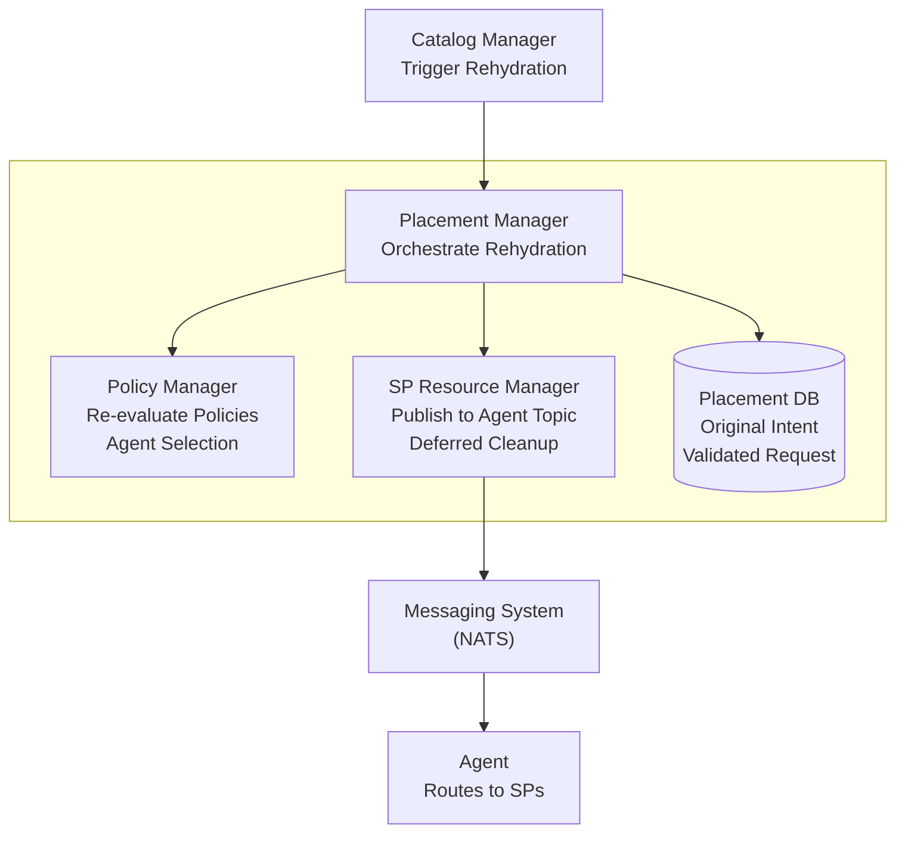
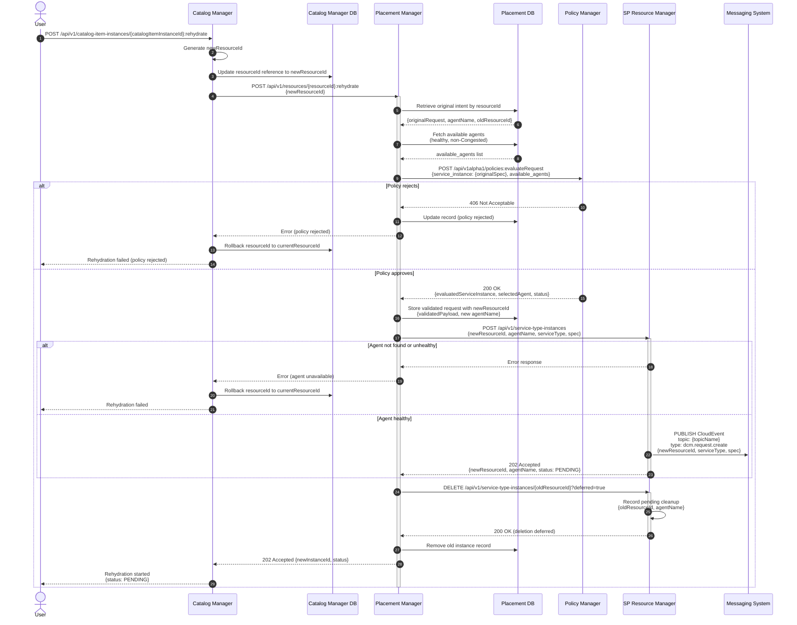
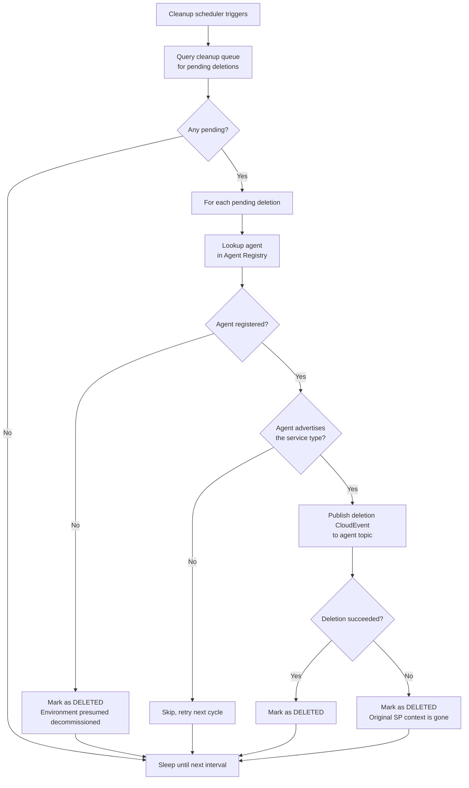
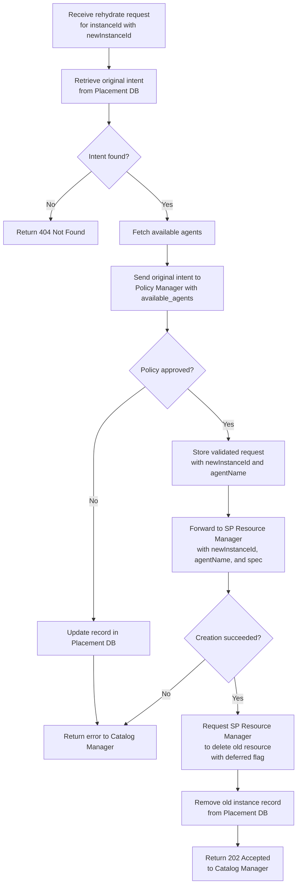

# Rehydration Flow

## Summary

Rehydration is the process of recreating an existing resource from its original
request (intent). The flow re-evaluates policies against the stored intent and
creates a new resource before deleting the old one. This allows the system to
absorb changes in policies and environment that occurred since the original
resource was provisioned.

## Motivation

Over time, policies, Agent availability, and environment configurations may
change. A resource that was provisioned under a previous set of policies may no
longer comply with current rules, or a more suitable Agent may have become
available. Rehydration enables administrators and users to bring existing
resources in line with the current state of the system without requiring manual
recreation.

### Goals

- Define the end-to-end rehydration flow across Catalog Manager, Placement
  Manager, and SP Resource Manager
- Define new API endpoints for triggering rehydration
- Define how deletion failures are handled when the original Agent is
  unavailable
- Define the deferred cleanup mechanism for resources that could not be deleted

### Non-Goals

- Modifying the original CatalogItemInstance, ServiceType, or CatalogItem
  definitions as part of rehydration
- Supporting partial rehydration (e.g., updating policies without recreating the
  resource)
- Defining update-in-place semantics

## Proposal

### Overview

Rehydration is triggered on an existing CatalogItemInstance. The flow
intentionally does **not** regenerate the ServiceType payload from the
CatalogItem. Instead, it uses the original intent stored in the Placement DB to
ensure that only policy and environment changes are reflected, not changes to
the underlying ServiceType or CatalogItem definitions.

#### ID Separation

The CatalogItemInstance ID used by the Catalog Manager is separate from the
InstanceID used by the Placement Manager and SP Resource Manager. During the
initial create flow, the Catalog Manager generates a InstanceID and passes it
downstream. The Catalog Manager maintains a mapping between its
CatalogItemInstance ID and the InstanceID. This separation is critical for
rehydration: it allows the Catalog Manager to generate a **new** InstanceID for
the recreated resource while the old InstanceID is still in use, avoiding ID
conflicts in the downstream services.

The high-level flow is:

1. User triggers rehydration on a CatalogItemInstance via the Catalog Manager
2. Catalog Manager generates a new InstanceID and calls the Placement Manager
   rehydrate endpoint with both the current and the new InstanceID
3. Placement Manager retrieves the original intent using the current InstanceID
4. Placement Manager re-evaluates policies against the original intent
5. Placement Manager instructs SP Resource Manager to create the new resource
   using the new InstanceID
6. Once the new resource is provisioned, Placement Manager instructs SP Resource
   Manager to delete the old resource using the old InstanceID

### System Architecture



### API Endpoints

#### Catalog Manager

| Method | Endpoint                                                         | Description                        |
| ------ | ---------------------------------------------------------------- | ---------------------------------- |
| POST   | /api/v1/catalog-item-instances/{catalogItemInstanceId}:rehydrate | Trigger rehydration of an instance |

**POST /api/v1/catalog-item-instances/{catalogItemInstanceId}:rehydrate**

Triggers rehydration of an existing CatalogItemInstance. The Catalog Manager
does **not** regenerate the ServiceType payload. It generates a new InstanceID
and delegates to the Placement Manager rehydrate endpoint, passing both the
current InstanceID and the new InstanceID.

Response: Returns `202 Accepted` if the rehydration process has started.

#### Placement Manager

| Method | Endpoint                                 | Description                    |
| ------ | ---------------------------------------- | ------------------------------ |
| POST   | /api/v1/resources/{instanceId}:rehydrate | Rehydrate an existing resource |

**POST /api/v1/resources/{instanceId}:rehydrate**

Triggers the rehydration of an existing resource. The Placement Manager
retrieves the original intent from the Placement DB and orchestrates creation of
the new resource followed by deletion of the old one.

Request body:

```json
{
  "newInstanceId": "<new-instance-id>"
}
```

Response: Returns `202 Accepted` if the rehydration process has started.

## Design Details

### Rehydration Flow



### Flow Description

1. **Rehydration Trigger**
   - User sends a POST request to the Catalog Manager rehydrate endpoint
   - Catalog Manager does **not** regenerate the ServiceType payload from the
     CatalogItem. This ensures that only policy and environment changes are
     applied, not changes to the underlying CatalogItem or ServiceType
   - Catalog Manager reads the current resourceId from its database
   - Catalog Manager generates a new resourceId for the downstream services
   - Catalog Manager updates its database with the new resourceId **before**
     calling Placement Manager (see
     [DB-First Update Order](#catalog-manager-db-first-update-order)). The
     update uses compare-and-swap (CAS): it only succeeds if the resourceId
     still matches the value read earlier, preventing concurrent rehydrates from
     both proceeding
   - Catalog Manager then forwards the request to the Placement Manager
     rehydrate endpoint with the current resourceId (in the URL) and the new
     resourceId (in the request body)

2. **Intent Retrieval**
   - Placement Manager retrieves the original intent (the user's original
     request) from the Placement DB using the current InstanceID
   - The original intent includes the spec, the current agentName, and the old
     InstanceID

3. **Fetch Available Agents**
   - Placement Manager queries the Agent Registry for healthy, non-Congested
     agents that support the requested service type
   - The resulting `available_agents` list is passed to the Policy Manager for
     evaluation

4. **Policy Re-evaluation**
   - Placement Manager sends the original intent to the Policy Manager with
     `available_agents` for evaluation against the current policy set
   - Policy Manager evaluates the request through the full policy chain (Global,
     Tenant, User)
   - If the policy rejects the request, the Placement Manager updates the record
     and returns an error to Catalog Manager, which rolls back its database to
     the original resourceId
   - If the policy approves, the Placement Manager receives the evaluated
     payload and the newly selected Agent (`selectedAgent`)

5. **Resource Creation**
   - Placement Manager stores the new validated request in the Placement DB with
     the new InstanceID and the new `agentName`
   - Placement Manager delegates instance creation to SP Resource Manager with
     the new InstanceID, the new agentName, serviceType, and the evaluated spec
   - Since the new InstanceID is different from the old one, there is no ID
     conflict in SP Resource Manager
   - SP Resource Manager publishes a creation CloudEvent to the agent's
     messaging topic
   - On success, the resource enters `PENDING` state
   - On failure, Catalog Manager rolls back its database to the original
     resourceId

6. **Delete Old Resource**
   - Once the new resource is created, Placement Manager requests SP Resource
     Manager to delete the old resource using the old InstanceID with the
     `deferred` flag set to `true`
   - SP Resource Manager immediately records the instance in the cleanup queue
     for background deletion without publishing to the agent (see
     [Deferred Deletion](#deferred-deletion))
   - SP Resource Manager returns success to allow the flow to continue
   - Placement Manager removes the old instance record from the Placement DB and
     returns success to the Catalog Manager

### Handling Deletion of the Old Resource

#### Deferred Deletion

During rehydration, the deletion request is sent with the `deferred` flag set to
`true`. When the SP Resource Manager receives a deferred deletion request, it
does **not** publish a deletion CloudEvent to the Agent. Instead, it immediately
enqueues the instance for background cleanup:

1. The SP Resource Manager records the pending deletion in a **cleanup queue**
   (persisted in the database) with the following information:
   - `instanceId`: The instance to be deleted
   - `agentName`: The Agent that manages the instance
   - `serviceType`: The type of the service
   - `timestamp`: When the deletion was requested
2. The SP Resource Manager returns success to the Placement Manager, allowing
   the rehydration flow to continue

#### Cleanup Mechanism

The SP Resource Manager runs a background cleanup process that periodically
attempts to complete deferred deletions. The cleanup queue serves two purposes:

1. **Rehydration deferred deletions**: When the Placement Manager sends a
   deletion with `deferred=true`, SPRM enqueues it without publishing to the
   Agent (described above).
2. **SP-unavailable deletion failures**: When a regular deletion is rejected by
   the Agent because the SP became Unavailable, SPRM enqueues it for deferred
   retry rather than marking the resource as failed (see
   [Placement Manager — Service Deletion Flow](../placement-manager/placement-manager.md#service-deletion-flow)).

The scheduler applies the following resolution logic for each pending deletion:



**Resolution rules:**

- **Agent not registered**: The Agent and its environment are presumed
  decommissioned. The resource is marked as `DELETED` and removed from the
  cleanup queue.
- **Agent registered but service type not advertised**: The SP for the service
  type has not recovered yet. The scheduler skips the entry and retries on the
  next cycle.
- **Agent registered and service type advertised — deletion succeeds**: The SP
  processed the deletion. The resource is marked as `DELETED`.
- **Agent registered and service type advertised — deletion fails**: The service
  type is now served by a different SP that has no knowledge of the resource
  (the original SP's infrastructure is gone). The resource is marked as
  `DELETED` because there is nothing left to clean up from DCM's perspective.

**Cleanup queue record:**

```json
{
  "instanceId": "08aa81d1-a0d2-4d5f-a4df-b80addf07781",
  "agentName": "prod-eu-agent",
  "serviceType": "vm",
  "requestedAt": "2026-03-23T10:00:00Z",
  "retryCount": 0,
  "status": "PENDING",
  "lastAttempt": null
}
```

#### Key Characteristics

- **Non-blocking**: Deferred deletion does not publish to the Agent, so the
  calling flow is never blocked by agent latency or availability
- **Persistent**: The cleanup queue is stored in the database to survive
  restarts
- **Automatic retry**: The cleanup process retries deletions once the Agent
  re-advertises the service type
- **Deterministic resolution**: Every terminal outcome marks the resource as
  `DELETED` — either the deletion succeeds, the original SP context is gone, or
  the environment is decommissioned. No entry remains in the queue indefinitely.
- **Idempotent**: Cleanup deletions are idempotent; repeated attempts to delete
  an already-deleted resource are safe

### Placement Manager Rehydration Flowchart



### Key Characteristics

- **Intent Preservation**: Rehydration operates on the original user intent, not
  the current CatalogItem or ServiceType definitions. This ensures that only
  policy and environment changes are reflected
- **Create-before-Delete**: The new resource is created before the old one is
  deleted. This ensures the system is never left without a running resource
  during the rehydration process
- **ID Separation**: The CatalogItemInstance ID is separate from the InstanceID
  used downstream. This allows the Catalog Manager to issue a new InstanceID for
  the recreated resource, avoiding ID conflicts in downstream services
- **Policy Re-evaluation**: Every rehydration re-evaluates the full policy
  chain, potentially selecting a different Agent or applying different mutations
- **Deferred Cleanup**: Deletion of the old resource is always deferred during
  rehydration. The SP Resource Manager enqueues the old instance for background
  cleanup without publishing to the Agent, ensuring the rehydration flow is
  never blocked by agent availability or errors
- **Idempotent Rehydration**: Rehydrating an already-rehydrated resource works
  the same way; a new resource is created from the original intent and the
  current resource is deleted afterward

### Catalog Manager: DB-First Update Order

The Catalog Manager uses a **DB-first** approach when updating the `resource_id`
during rehydration. The database is updated before calling Placement Manager,
and rolled back if the PM call fails.

#### Why DB-First?

The alternative approach (PM-first) would call Placement Manager before updating
the database. While this ensures the database always points to a resource that
exists in PM, it introduces a significant risk: **orphaned resources**.

| Approach     | Tradeoff                                                                                                                                                                                                 |
| ------------ | -------------------------------------------------------------------------------------------------------------------------------------------------------------------------------------------------------- |
| **PM-first** | DB always points to something real, but if the DB update fails, PM has provisioned a resource that the DB doesn't reference. These orphans are invisible to the system and silently leak infrastructure. |
| **DB-first** | DB may briefly point to a `resource_id` that PM hasn't provisioned yet (a window of milliseconds), but we rollback immediately on PM failure, and any inconsistency is easily detected.                  |

The key insight: **DB inconsistencies are cheap to detect and fix; PM orphans
leak real infrastructure silently.**
