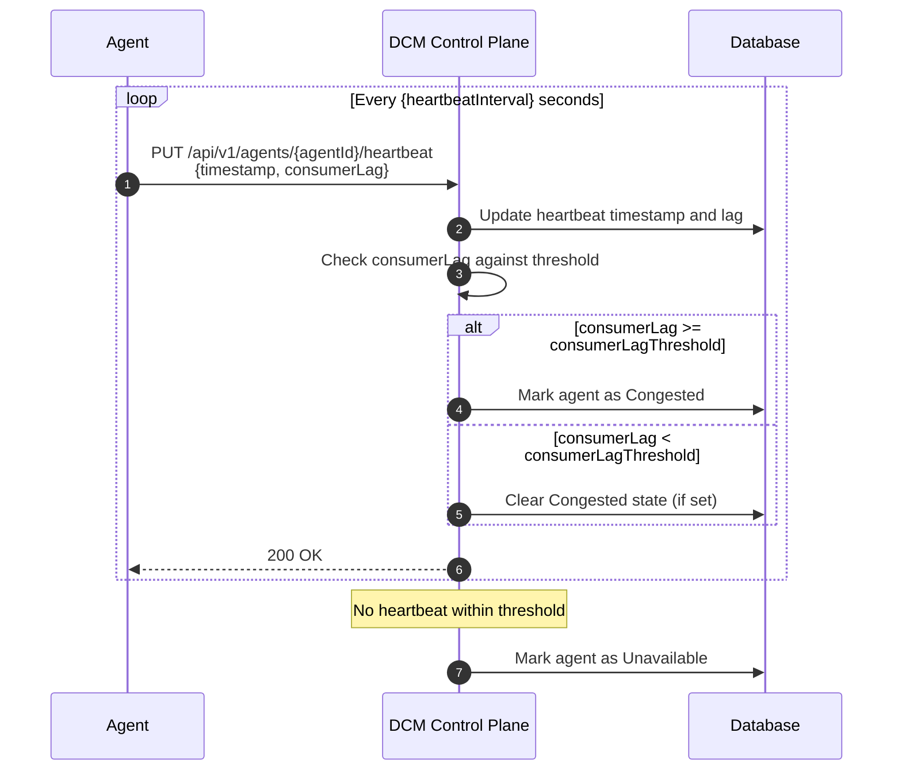
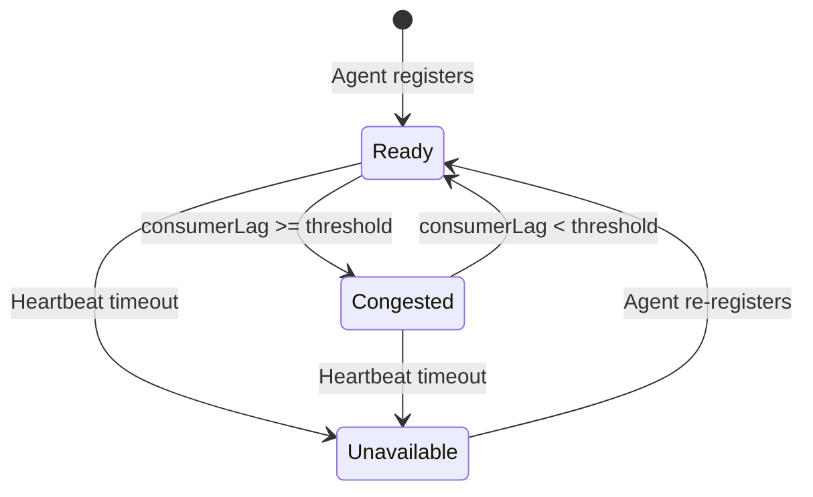

# Service Provider Health Check

## Summary

The Environment Agent monitors SP health using two mechanisms: in-process checks
for embedded SPs (K8s Container, ACM Cluster, KubeVirt) and polling the
`/health` endpoint for external SPs. DCM monitors Agent health via heartbeats
and consumer lag reporting.

## Motivation

Define how SP health is monitored by the Agent, and how Agent health and
congestion are monitored by DCM.

### Goals

- Define the polling mechanism where the Agent checks SP health.
- Define a standard `/health` endpoint for all Service Providers.
- Define the heartbeat mechanism by which DCM monitors Agent health.
- Define consumer lag monitoring and the Congested agent state.

### Non-Goals

- Status reporting of individual services running _on_ the provider.
- Deep provider diagnostics (out of scope for liveness check).
- Agent high availability (deferred to HA iteration).

## Proposal

### Overview

The Agent acts as the prober for SP health. The monitoring mechanism differs by
SP type: embedded SPs are checked in-process (the agent directly checks the
embedded SP's internal state without a network call), while external SPs are
checked by polling their `/health` endpoint at a configurable interval. DCM
monitors Agent health via periodic REST heartbeats and tracks consumer lag.

### Architecture

1. **SP Health Monitoring (Agent → SP):**
   - **Embedded SPs:** Health is determined in-process — the agent directly
     checks the embedded SP's internal state without a network call.
   - **External SPs:** Health is determined by polling the SP's `/health`
     endpoint.
     - **Initiator:** Agent.
     - **Target:** Service Provider `/health` endpoint.
     - **Frequency:** Every 10 seconds (default).
     - **Success Criteria:** HTTP 200 OK.

2. **Agent Health Monitoring (Agent → DCM):**
   - **Mechanism:** Agent sends `PUT /api/v1/agents/{agentId}/heartbeat` to DCM.
   - **Frequency:** Every `heartbeatInterval` seconds (configurable).
   - **Failure:** If no heartbeat within configurable threshold, DCM marks agent
     as Unavailable.

3. **Consumer Lag Monitoring:**
   - Agent self-reports consumer lag in heartbeat payload
     `{timestamp, consumerLag}`.
   - DCM marks agent as **Congested** when lag exceeds `consumerLagThreshold`.
   - DCM stops routing new requests to a Congested agent.

### Health Check Flow

1. **Agent:** Iterates through the list of registered SPs (both embedded and
   external).
2. **Probing:** For each external SP, the Agent executes:
   `GET http://<sp-ip>:<port>/health`. Embedded SPs are checked in-process.
3. **State Machine:**
   - **Ready:** If response is `200 OK` and body `status` is `healthy`, reset
     failure counter and mark as `Ready`.
   - **Unhealthy:** If response is `200 OK` and body `status` is `unhealthy`,
     mark as `Unhealthy`. The service provider is reachable but the backing
     provider is unavailable.
   - **Failure:** If timeout or non-200 response, increment failure counter.
   - **Threshold:** If failures exceed the `FailureThreshold` (default: 3),
     transition provider to `Unavailable`.
4. **Recovery:** A single `200 OK` with `status` `healthy` transitions an
   `Unhealthy` or `Unavailable` provider back to `Ready`.

### Differentiated Behavior

Since only one SP (embedded or external) may serve a given service type per
agent, when that SP transitions out of the Ready state, the Agent's behavior
differs based on the health state. See the
[Environment Agent enhancement](../environment-agent/environment-agent.md) for
full details on retry topic behavior.

**Unhealthy:**

1. Agent **keeps** the service type in its advertised list (no update to DCM).
2. Stops routing to the SP. Incoming requests are held in the retry topic.
3. Publishes a `service-type-degraded` health warning CloudEvent.

**Unavailable** (after exceeding failure threshold):

1. Agent **removes** the service type from its advertised list.
2. Sends `POST /api/v1/agents` to DCM with the updated registration.
3. Drains retry topic — rejects held requests with error CloudEvents.
4. Publishes a `service-type-unavailable` health warning CloudEvent.

**Recovery:**

1. Re-adds service type to advertised list if it was removed (Unavailable case)
   and sends `POST /api/v1/agents` to DCM with the updated registration.
2. Processes held requests from the retry topic.

## Agent Health Monitoring

The Agent reports its own liveness to DCM via periodic REST heartbeats. DCM
tracks the last heartbeat timestamp for each agent.

- **Endpoint:** `PUT /api/v1/agents/{agentId}/heartbeat`
- **Payload:** `{timestamp, consumerLag}`
- **Frequency:** Every `heartbeatInterval` seconds (configurable).
- If no heartbeat is received within a configurable threshold, DCM marks the
  agent as **Unavailable**.
- On restart, the Agent re-registers to DCM, which resets the heartbeat tracker.



## Consumer Lag Monitoring

The Agent self-reports the number of pending messages on its topic as
`consumerLag` in each heartbeat. DCM compares this value against a global
`consumerLagThreshold`.

- When `consumerLag >= consumerLagThreshold`, DCM marks the agent as
  **Congested** and stops routing new requests to it.
- When `consumerLag` drops below the threshold on a subsequent heartbeat, DCM
  clears the Congested state.

## Agent Health State Summary

| Condition                               | Agent State     |
| --------------------------------------- | --------------- |
| Heartbeat received, lag below threshold | **Ready**       |
| Heartbeat received, lag above threshold | **Congested**   |
| No heartbeat within threshold           | **Unavailable** |



## Design Details

### Service Provider Implementation

The SP health endpoint specification applies to external SPs only. Embedded SPs
are health-checked in-process and do not expose a `/health` endpoint. The only
difference from the original design is that the Agent, not DCM, is the caller
for external SPs.

The Service Provider must expose a lightweight unauthenticated (or internally
secured) endpoint.

#### Health Endpoint

**Endpoint:** `GET /health`

**Expected Response:**

- **Code:** `200 OK`
- **Body:**

```json
{
  "status": "healthy",
  "version": "v1.2.3",
  "uptime": 3600
}
```

The `status` field indicates the health of the backing provider:

- `healthy` — The service provider and its backing provider are operational. The
  Agent marks the provider as **Ready**.
- `unhealthy` — The service provider is reachable but the backing provider is
  unavailable. The Agent marks the provider as **Unhealthy**.

**Unhealthy Response Example:**

```json
{
  "status": "unhealthy",
  "version": "v1.2.3",
  "uptime": 3600
}
```

#### Provider State Summary

| HTTP Response     | `status` field | SP State                                             |
| ----------------- | -------------- | ---------------------------------------------------- |
| `200 OK`          | `healthy`      | **Ready**                                            |
| `200 OK`          | `unhealthy`    | **Unhealthy**                                        |
| Non-200 / Timeout | N/A            | **Unavailable** (after exceeding `FailureThreshold`) |

## Next Steps

- Agent HA: multiple agents sharing health-check duties.
- Authenticated health checks.
- Per-SP health check intervals.
