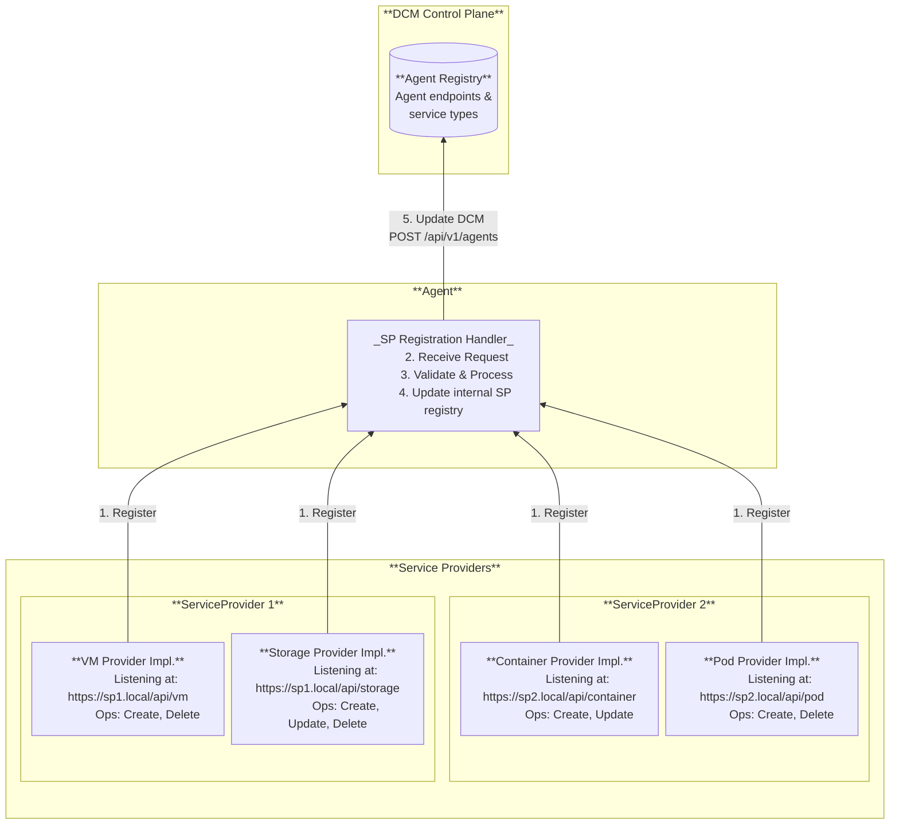
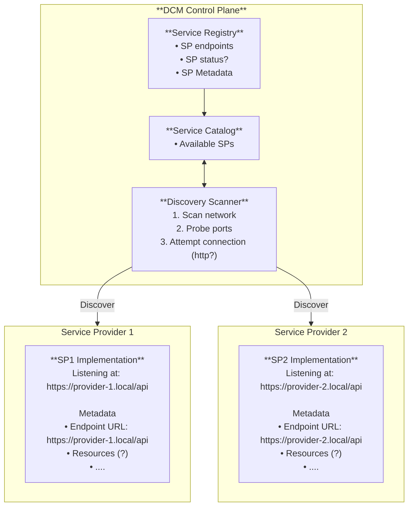
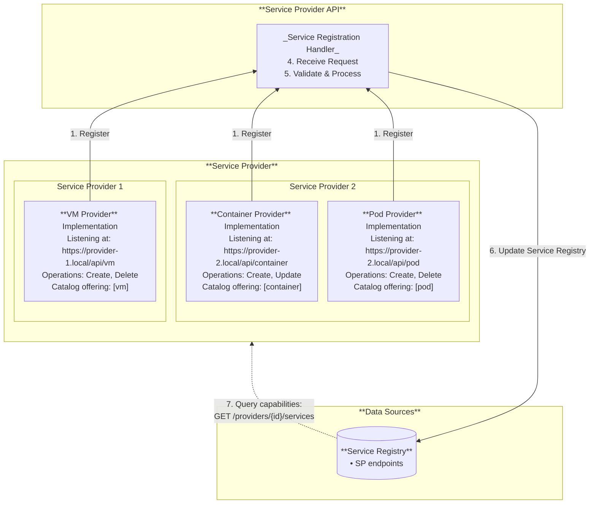

# Service Provider Registration Flow

## Summary

The DCM (Data Center Management) is designed to provide a unified control plane
for managing distributed infrastructure across multiple enclaves, including
air-gapped environments, regional datacenters, and isolated security zones (e.g.
ships, edge locations). In each target environment, an
[Agent](../environment-agent/environment-agent.md) runs as the intermediary
between DCM and the Service Providers (SPs) deployed in that environment.

The Agent supports a hybrid SP model: it ships with embedded SP code for known
service types (K8s Container, ACM Cluster, KubeVirt), enabled via configuration,
and also accepts external ("bring your own") SPs that register via the Agent's
SP Registration API (`POST /api/v1/providers`). Only one SP — embedded or
external — may serve a given service type per agent; duplicate registrations are
rejected with `409 Conflict`.

This document defines the registration contract for external SPs — API shape,
idempotency semantics, and natural key behavior. Embedded SPs register
internally at agent startup without a REST call and do not use this flow.

The Agent, in turn, registers itself to DCM via a separate API
(`POST /api/v1/agents`), advertising the environment and the aggregated list of
service types it can serve. DCM's Registration Handler no longer receives SP
registrations directly; it receives Agent registrations. The Agent Registration
Flow is defined in the
[Environment Agent enhancement](../environment-agent/environment-agent.md#agent-registration-flow).

## Motivation

### Goals

- Define the registration mechanism by which external Service Providers become
  known to the Agent, and how the Agent becomes known to DCM.
- Define the service type uniqueness constraint (one SP per service type).

### Non-Goals

- Implementing details of registration API
- Service Provider Authentication/Authorization
- Service catalog schema
- DCM Control Plane definition
- Meta-service-provider design
- Service Provider's policies
- Embedded SP registration (these register internally at agent startup; see the
  [Environment Agent enhancement](../environment-agent/environment-agent.md#embedded-sp-registration))
- Agent registration to DCM (defined in the
  [Environment Agent enhancement](../environment-agent/environment-agent.md#agent-registration-flow))

## Proposal

### Implementation Details/Notes/Constraints

#### Terminology

External Service Providers must register using the Agent's SP Registration API
to operate within the DCM system. The Agent implements the provider registration
endpoint (`POST /api/v1/providers`), applying the same contract defined in this
document. Embedded SPs (K8s Container, ACM Cluster, KubeVirt) register
internally at agent startup and do not use this endpoint.

The registration phase provides the Agent with the SP endpoint, metadata and
capabilities so it can route creation requests to the appropriate SP. The
registration call can be initiated either by the SP itself during start up phase
or by a third party (e.g. platform admins) on behalf of the SP. Both approaches
use the same registration API.

Only one SP — embedded or external — may serve a given service type per agent.
If the requested service type is already served by another SP (embedded or
external), the Agent rejects the registration with `409 Conflict` (see the
[Environment Agent enhancement](../environment-agent/environment-agent.md#sp-registration-to-agent)
for the full service type uniqueness constraint).

The _initial implementation_ will focus only on the **self registration flow**.

The _SP Registration API_ is hosted by the Agent and defines the contract
between the Agent and Service Providers. It includes the endpoint for provider
registration. The
[Service Provider API specification](https://github.com/Fale/dcm/blob/od/api/interoperabilityAPI.yaml)
is under development.

DCM implements `POST /api/v1/agents` for Agent registration (defined in the
[Environment Agent enhancement](../environment-agent/environment-agent.md#post-apiv1agents--agent-registration)).

#### Architectural Assumptions

SPs require network connectivity to the Agent. The Agent requires outbound
connectivity to DCM (for registration and heartbeats) and to the Messaging
System. DCM requires connectivity to the Messaging System. Direct SP-to-DCM
connectivity is not required.

#### Registration Flow

##### Static approach

Registration is per service type. Each Service Provider may support multiple
service types (e.g., VMs and Containers), but it must register **separately**
for each type. This design provides clear endpoint separation and avoids complex
capability matrices.



- Admins predefine supported
  [Service Types](https://github.com/dcm-project/enhancements/blob/main/enhancements/service-type-definitions/service-type-definitions.md)
  (e.g., "vm", "database")
- A registration call must be made to the Agent's SP Registration endpoint for
  each service type the SP supports. The payload includes:
  1. Unique provider name
  2. Unique providerID (optional, server-generated if not provided)
  3. Endpoint URL (e.g.,
     [https://provider-1.local/api](https://provider-1.local/api))
  4. Service type this provider can fulfill (e.g., _"vm"_, _"container"_)
  5. Metadata (optional: zone, region, resource constraints)
  6. Operations supported for this service type (optional, e.g., _"create"_,
     _"delete"_)
- The Agent processes and validates the metadata
- The Agent stores the SP registration in its internal registry and recomputes
  its list of supported service types
- When the Agent's service type list changes (new type added or removed), the
  Agent updates DCM via `POST /api/v1/agents` (see the
  [Environment Agent enhancement](../environment-agent/environment-agent.md#sp-registration-to-agent)
  for the full flow)
- When user requests a catalog offering, DCM's Control Plane matches it to a
  registered Agent that can fulfill it based on configured policies and routes
  the request through the messaging system to the Agent, which forwards it to
  the selected SP

The Service Provider's _name_ is the natural key used to match existing
registrations.

Per [AEP-133](https://aep.dev/133/), when a client wants to specify the
_providerID_, it must be passed as a query parameter (`?id=...`), not in the
request body. This allows the `id` field in the schema to be `readOnly`,
preventing conflicts between query param and body values. The server sets `id`
from the query parameter or auto-generates it if not provided.

The registration endpoint is idempotent. These idempotency semantics apply at
the Agent level for SP registration. During the registration phase:

- If the _name_ does not exist in the Agent's registry, a new SP entry is
  created. If no _providerID_ is specified, the Agent will automatically
  generate one.
- If the _name_ already exists and no _providerID_ is provided (or the same
  _providerID_ is provided), the existing entry is updated and the same
  _providerID_ is returned.
- If the _name_ already exists but a **different** _providerID_ is provided,
  registration fails (conflict: another SP is attempting to register with a
  taken name).
- If a new _name_ is provided but the _providerID_ already exists in the Agent's
  registry, registration fails (conflict: _providerID_ is already assigned to
  another SP).

Identical idempotency semantics (same `name` natural key pattern) apply at DCM
level for Agent registration, as defined in the
[Environment Agent enhancement](../environment-agent/environment-agent.md#re-registration-on-restart).

The response to a registration request will always include the _providerID_,
regardless of whether it was generated or provided. Consistent with AEP, the
response payload mirrors the request payload with possibly updated values.

##### Update Service Provider capabilities flow

The registration endpoint is idempotent. If an SP's capabilities change
(typically due to a new version following a restart), the SP (or admin) can call
the same registration endpoint again. The Agent will update the existing SP
entry rather than creating a duplicate.

When an SP re-registers with updated capabilities, the Agent recomputes its
service type list and, if changed, updates DCM via `POST /api/v1/agents`.

- SP serviceType changes
- SP restarts and re-registers using the same Agent SP Registration API endpoint
- The Agent updates the existing SP entry in its internal registry with the new
  serviceType
- The Agent detects that the SP already exists by matching the Service Provider
  _name_
- The Agent updates the existing SP entry with the new serviceType and returns
  the same providerID.
- There are 3 potential scenarios for updating a Service Provider:

1. SP's _name_ update: If only the SP's name changes (but the providerID remains
   the same), the Agent updates the SP's name. An attempt to update with a
   pre-existing SP's name will result in failure.
2. _providerID_ update: If only the _providerID_ changes (but the SP's _name_
   remains the same), the Agent updates the providerID. An attempt to update
   with a pre-existing _providerID_ will result in failure.
3. Both the SP's name and providerID change: The Agent cannot reliably determine
   if this is an update to the existing SP or a new registration of a distinct
   SP. In this scenario the required action is to delete and re-create the SP.

###### Example

- First registration (with client-specified id):

`POST /api/v1/providers?id=uuid-1234` (on the Agent)

```yaml
{
  "endpoint": "https://sp1.example.com/api/v1/vm",
  "name": "kubevirt-123",
  "displayName": "KubeVirt Service Provider",
  "serviceType": "vm",
  "metadata": {
    "region": "us-east-1",
    "status": "healthy",
    "resources": {
      "totalCpu": 200,
      "totalMemory": "1TB",
      "totalStorage": "2TB",
      "totalNode": 100
      }
  }
}

Response:
{
  "id": "uuid-1234",
  "name": "kubevirt-123",
  "displayName": "KubeVirt Service Provider",
  "endpoint": "https://sp1.example.com/api/v1/vm",
  "serviceType": "vm",
  "status": "registered",
  "metadata": { ... }
}
```

- First registration (with server generated id):

`POST /api/v1/providers` (on the Agent)

```yaml
{
  "endpoint": "https://sp1.example.com/api/v1/vm",
  "name": "kubevirt-123",
  "displayName": "KubeVirt Service Provider",
  "serviceType": "vm",
  "metadata": { ... }
}

Response:
{
  "id": "auto-generated-uuid",
  "name": "kubevirt-123",
  ...
  "status": "registered"
}
```

- Re-registration (SP restarts, same endpoint):

`POST /api/v1/providers` (on the Agent)

```yaml
{
  "endpoint": "https://sp1.example.com/api/v1/vm",
  "name": "kubevirt-123",
  "displayName": "KubeVirt Service Provider",
  "serviceType": "vm",
  "metadata": {
    "region": "us-east-1",
    "zone": "datacenter-b"
  }
}

Response:
{
  "id": "uuid-1234",
  "name": "kubevirt-123",
  ...
  "status": "updated"
}
```

### Risks and Mitigations

The risks related to the Agent-based architecture (agent as single point of
failure, unauthenticated SP registration, messaging system dependencies) are
documented in the
[Environment Agent enhancement](../environment-agent/environment-agent.md#risks-and-mitigations).

### Next Steps

- HA agent replicas for high availability per environment
- Authenticated SP registration (AuthN/AuthZ for the Agent's SP Registration
  API)
- Dynamic cost tier updates without agent restart

## Alternatives

The following alternatives were evaluated before the current Agent-based
architecture was adopted. They are retained for historical context.

### Dynamic Registration Approach

#### Description

This approach separates registration from capability advertisement. The benefit
is that the Control Plane always queries real-time capacity and availability
during placement decisions, rather than relying on potentially stale cached
capabilities. This is useful when SP capabilities change frequently based on
resource availability. Same as the static approach the registration process is
per service type.



- Admins predefine supported ServiceTypes (e.g., "vm", "database")
- Each Service Provider must implement Services API contract at a reachable
  endpoint
- Each Service Provider must make a _minimal_ registration call to the Service
  Provider API (Registration Handler endpoint) for each service type with:
  1. Endpoint URL (e.g.,
     [https://provider-1.local/api](https://provider-1.local/api))
  2. Basic Metadata
  3. (Note: no capabilities or catalog references at registration time)
- The Registration Handler receives the request
- The Registration Handler processes and validates the metadata
- The Registration Handler internally updates only the Service Registry
- Periodically, the control Plane makes a call to each SP registered
  `/providers/{id}/services` API
- Each registered SP returns:
  1. real-time capabilities, capacity, and availability
  2. which serviceType it can currently fulfill
- When a user requests a catalog offering, Control Plane selects the best SP and
  calls its endpoint.

The Service Provider registration operates on a **push model**, where the SPs
proactively send registration information to the Service Provider API
(Registration Handler endpoints). However, during placement operations, the DCM
Control Plane **pulls** information from the Service Provider API.

- _Registration:_ The SP initiates the process by pushing registration
  information to the Control Plane.
- Workflow Execution The Control Plane pushes provisioning requests to the SP.

#### Pros

- Decentralized Control It's the SME team that maintains control over when their
  SPs become active in the system
- Efficient Registration Complete metadata is provided in a single registration
  call.
- Scalability Supports large-scale deployments, handling tens to hundreds of
  distributed SP instances
- Industry Alignment Consistent with established industry patterns (e.g.,
  Kubernetes, Crossplane, Consul).

#### Cons

- Protocol Understanding SP implementers are required to understand the
  registration protocol.
- Explicit Registration An explicit registration step is necessary; automatic
  discovery is not supported.
- Re-registration on Change Any changes to the SP endpoint necessitate a
  re-registration process.

#### Why rejected

Adds complexity without clear benefits for initial implementation. The static
approach provides simpler, predictable registration while still supporting
capability updates through re-registration.

### DCM Discovery Approach

#### Description

The DCM actively scans endpoints to discover and register SPs.



#### Registration Flow

1. SP deploys and implements Services API that are listening on a network
   endpoint
2. Discovery Scanner periodically scans ip addresses/ports/dns names (?)
   invoking the `GET /discover`
3. SP replies with metadata payload
4. Control Plane validates response and authenticate the SP identity
5. CP updates Service Registry with SP endpoints and metadata
6. CP update Service Catalog with SP offered services

#### Pros

- Automatic Discovery No explicit registration step is needed from the Service
  Provider (SP).
- Centralized Control The Control Plane manages the discovery process, providing
  a centralized view and timing control.
- Passive SPs SPs are passive; they wait to be discovered instead of actively
  registering.
- Automatic Change Detection Changes to SP endpoints can be automatically
  detected via re-scanning, provided the endpoint is reachable.

#### Cons

- Air-Gapped Discovery fails in disconnected networks
- Firewall Issues Inbound scanning is typically blocked by network security
  policies.
- Scalability Concerns Scanning is impractical for hundreds of SPs across
  various networks and security zones.
- Discovery Delay A time gap exists between SP deployment and its actual
  discovery (dependent on the scan interval).
- Network Configuration Overhead Requires maintenance of network ranges and port
  configurations for scanning.
- SP Cooperation Still Needed SPs must still implement a discovery endpoint and
  respond with metadata.
- Security Risks Network scanning can trigger security alerts or violate
  existing security policies.
- Lack of Readiness Control SME teams cannot control when SPs join the system or
  signal maintenance windows
- Persistent Network Routes The Control Plane must maintain network routes to
  all SP networks.

#### Why rejected

Too complex for initial delivery. Requirements for network scanning, discovery
protocols, and security policies are not yet defined. The Agent-based
architecture further reinforces this rejection: the Agent eliminates the need
for direct DCM-to-SP connectivity, making a DCM-driven network scanning approach
even less aligned with the current architecture.
