# DCM User Flows

This document summarizes the primary user flows in the DCM system, covering
policy management, service type and catalog item management, service provider
and agent lifecycle, and end-to-end CatalogItemInstance creation and deletion.

## Table of Contents

- [1. System Overview](#1-system-overview)
- [2. Managing Policies](#2-managing-policies)
  - [2.1 Create Policy](#21-create-policy)
  - [2.2 Policy Evaluation](#22-policy-evaluation)
- [3. Managing ServiceTypes](#3-managing-servicetypes)
  - [3.1 ServiceType Registration](#31-servicetype-registration)
  - [3.2 Supported ServiceTypes](#32-supported-servicetypes)
- [4. Managing CatalogItems](#4-managing-catalogitems)
  - [4.1 Create CatalogItem](#41-create-catalogitem)
  - [4.2 CatalogItem to ServiceType Translation](#42-catalogitem-to-servicetype-translation)
- [5. Service Provider & Agent Lifecycle](#5-service-provider--agent-lifecycle)
  - [5.1 Service Provider Registration (SP → Agent)](#51-service-provider-registration-sp--agent)
  - [5.2 Agent Registration (Agent → DCM)](#52-agent-registration-agent--dcm)
  - [5.3 Health Monitoring](#53-health-monitoring)
    - [5.3.1 SP Health (Agent → SP)](#531-sp-health-agent--sp)
    - [5.3.2 Agent Health (Agent → DCM heartbeats)](#532-agent-health-agent--dcm-heartbeats)
    - [5.3.3 Consumer Lag Monitoring](#533-consumer-lag-monitoring)
  - [5.4 Service Provider Status Reporting](#54-service-provider-status-reporting)
  - [5.5 Agent Lifecycle](#55-agent-lifecycle)
- [6. CatalogItemInstance Creation (End-to-End)](#6-catalogiteminstance-creation-end-to-end)
  - [6.1 Full Creation Flow](#61-full-creation-flow)
  - [6.2 Placement Manager Flow](#62-placement-manager-flow)
  - [6.3 SP Resource Manager Flow](#63-sp-resource-manager-flow)
  - [6.4 Service Provider Instance Creation](#64-service-provider-instance-creation)
  - [6.5 Continuous Status Reporting](#65-continuous-status-reporting)
  - [6.6 Deletion Flow](#66-deletion-flow)

---

## 1. System Overview

The DCM system is composed of the following core components:

| Component                          | Responsibility                                                                                                          |
| ---------------------------------- | ----------------------------------------------------------------------------------------------------------------------- |
| **Catalog Manager**                | Entry point for user requests; manages CatalogItems and CatalogItemInstances                                            |
| **Catalog DB**                     | Stores CatalogItems, CatalogItemInstances, and ServiceType definitions                                                  |
| **Placement Manager**              | Orchestrates instance creation; coordinates policy evaluation and agent selection                                       |
| **Policy Manager (Policy Engine)** | Validates, mutates, and selects Agents via REGO policies and OPA                                                        |
| **SP Resource Manager**            | Intermediary between Placement Manager and Agents; publishes CloudEvents to agent topics; consumes responses            |
| **Agent Registry**                 | Stores Agent registration data (name, environment, serviceTypes, topicName, cost, healthStatus)                         |
| **Service Providers**              | Execute infrastructure provisioning (KubeVirt SP, K8s Container SP, K8s Storage SP, ACM Cluster SP)                     |
| **Environment Agent**              | Runs in target environment; routes creation/deletion requests to SPs; monitors SP health; reports to DCM via heartbeats |
| **Messaging System**               | Handles CloudEvents for asynchronous request delivery and status reporting (NATS)                                       |

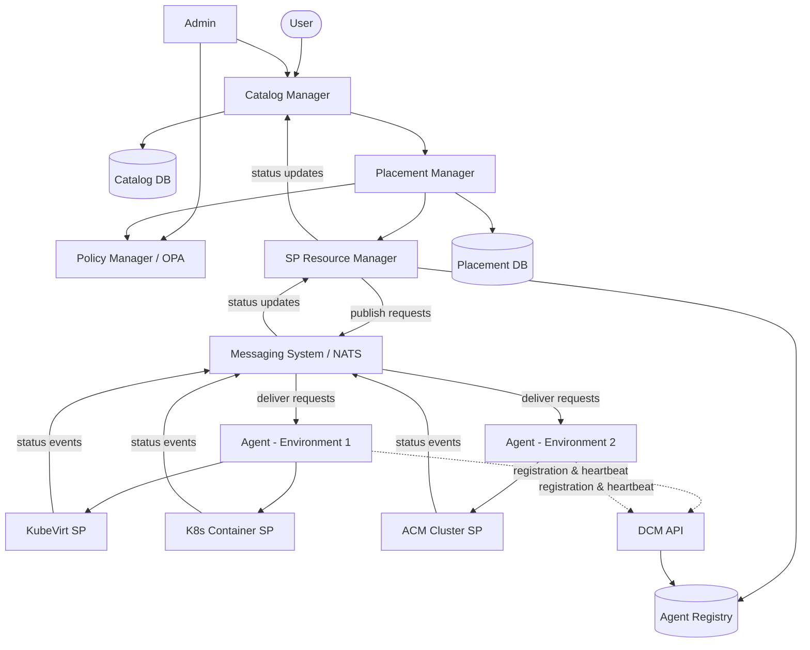
```mermaid
graph TB
    User([User])
    Admin[Admin]
    CM[Catalog Manager]
    CDB[(Catalog DB)]
    PM[Placement Manager]
    POL[Policy Manager / OPA]
    SPRM[SP Resource Manager]
    AR[(Agent Registry)]
    DB[(Placement DB)]
    MS[Messaging System / NATS]

    AG1[Agent - Environment 1]
    AG2[Agent - Environment 2]
    SP1[KubeVirt SP]
    SP2[K8s Container SP]
    SP3[ACM Cluster SP]

    User --> CM
    Admin --> CM
    Admin --> POL
    CM --> CDB
    CM --> PM
    PM --> POL
    PM --> SPRM
    PM --> DB
    SPRM --> AR
    SPRM -->|publish requests| MS
    MS -->|deliver requests| AG1
    MS -->|deliver requests| AG2
    AG1 --> SP1
    AG1 --> SP2
    AG2 --> SP3
    AG1 -.->|registration & heartbeat| DCM_API
    AG2 -.->|registration & heartbeat| DCM_API
    DCM_API[DCM API]
    DCM_API --> AR

    SP1 -->|status events| MS
    SP2 -->|status events| MS
    SP3 -->|status events| MS
    MS -->|status updates| SPRM
    SPRM -->|status updates| CM
```

---

## 2. Managing Policies

Policies control validation, mutation, and Agent selection for all resource
requests. They are organized in a three-level hierarchy: **Global** (Super
Admin), **Tenant** (Tenant Admin), and **User** (End User).

### 2.1 Create Policy

An administrator creates a policy by providing a name, type, priority, label
selector, and REGO code. The Policy Manager validates uniqueness, compiles the
REGO via OPA, and stores the policy metadata.

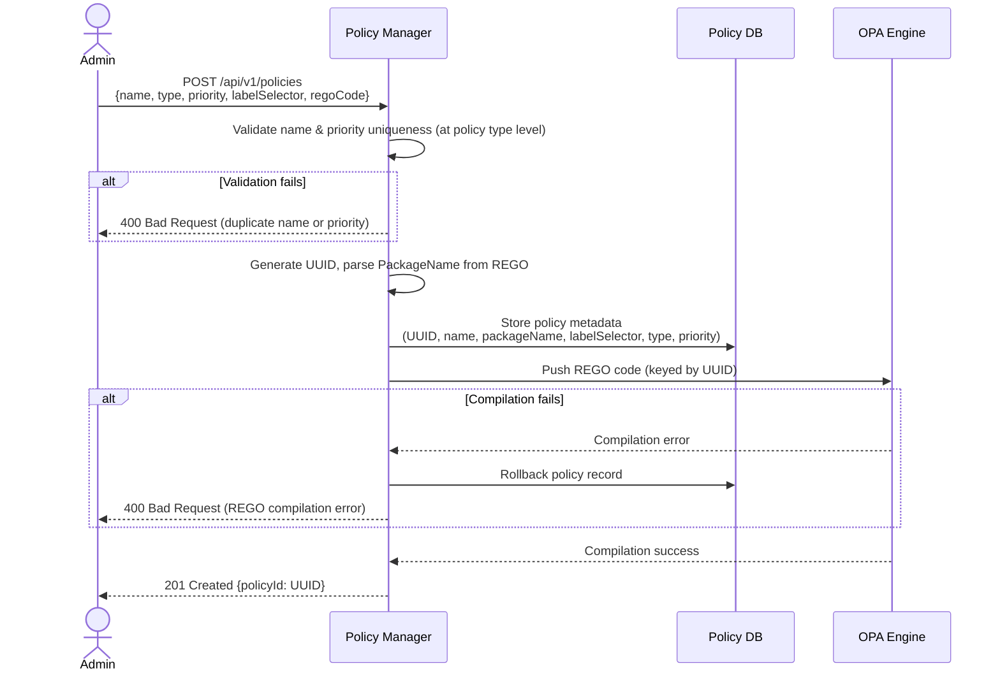
```mermaid
sequenceDiagram
    actor Admin
    participant PM as Policy Manager
    participant DB as Policy DB
    participant OPA as OPA Engine

    Admin->>PM: POST /api/v1/policies<br/>{name, type, priority, labelSelector, regoCode}
    PM->>PM: Validate name & priority uniqueness (at policy type level)
    alt Validation fails
        PM-->>Admin: 400 Bad Request (duplicate name or priority)
    end
    PM->>PM: Generate UUID, parse PackageName from REGO
    PM->>DB: Store policy metadata<br/>(UUID, name, packageName, labelSelector, type, priority)
    PM->>OPA: Push REGO code (keyed by UUID)
    alt Compilation fails
        OPA-->>PM: Compilation error
        PM->>DB: Rollback policy record
        PM-->>Admin: 400 Bad Request (REGO compilation error)
    end
    OPA-->>PM: Compilation success
    PM-->>Admin: 201 Created {policyId: UUID}
```

**Policy payload example:**

```json
{
  "name": "restrict-region",
  "type": "Global",
  "priority": 10,
  "labelSelector": { "serviceType": "vm" },
  "enabled": true,
  "regoCode": "package restrict_region\n..."
}
```

### 2.2 Policy Evaluation

When a resource request arrives, the Policy Manager fetches all matching enabled
policies, sorts them by level (Global > Tenant > User) then priority
(ascending), and evaluates them in a chain-of-responsibility pipeline. Each
policy can reject the request, apply patches (mutations), set constraints, and
influence Agent selection.

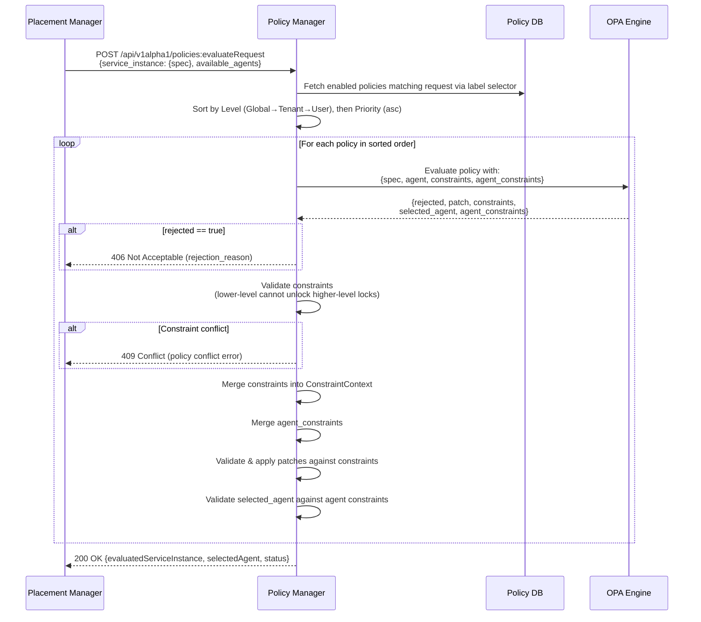
```mermaid
sequenceDiagram
    participant PM as Placement Manager
    participant PE as Policy Manager
    participant DB as Policy DB
    participant OPA as OPA Engine

    PM->>PE: POST /api/v1alpha1/policies:evaluateRequest<br/>{service_instance: {spec}, available_agents}

    PE->>DB: Fetch enabled policies matching request via label selector
    PE->>PE: Sort by Level (Global→Tenant→User), then Priority (asc)

    loop For each policy in sorted order
        PE->>OPA: Evaluate policy with:<br/>{spec, agent, constraints, agent_constraints}
        OPA-->>PE: {rejected, patch, constraints,<br/>selected_agent, agent_constraints}

        alt rejected == true
            PE-->>PM: 406 Not Acceptable (rejection_reason)
        end

        PE->>PE: Validate constraints<br/>(lower-level cannot unlock higher-level locks)
        alt Constraint conflict
            PE-->>PM: 409 Conflict (policy conflict error)
        end

        PE->>PE: Merge constraints into ConstraintContext
        PE->>PE: Merge agent_constraints
        PE->>PE: Validate & apply patches against constraints
        PE->>PE: Validate selected_agent against agent constraints
    end

    PE-->>PM: 200 OK {evaluatedServiceInstance, selectedAgent, status}
```

**Evaluation request (Placement Manager → Policy Manager):**

```json
{
  "service_instance": {
    "spec": {
      "serviceType": "vm",
      "memory": { "size": "2GB" },
      "vcpu": { "count": 2 },
      "guestOS": { "type": "fedora-39" },
      "metadata": { "name": "fedora-vm" }
    }
  },
  "available_agents": [
    {
      "name": "agent-prod-eu-west-1",
      "environment": "prod-eu-west-1",
      "serviceTypes": ["vm", "container"],
      "cost": "medium"
    },
    {
      "name": "agent-dev-us-east-1",
      "environment": "dev-us-east-1",
      "serviceTypes": ["vm"],
      "cost": "low"
    }
  ]
}
```

**Policy input (per policy, passed to OPA):**

```json
{
  "spec": {
    "serviceType": "vm",
    "memory": { "size": "2GB" },
    "vcpu": { "count": 2 },
    "guestOS": { "type": "fedora-39" },
    "metadata": { "name": "fedora-vm" }
  },
  "agent": "",
  "constraints": {},
  "agent_constraints": {},
  "available_agents": [
    {
      "name": "prod-eu-agent",
      "environment": "prod-eu-west-1",
      "serviceTypes": ["vm", "database"],
      "cost": "medium"
    }
  ],
  "exclude_agents": []
}
```

**Policy decision format (per policy, returned by OPA):**

```json
{
  "rejected": false,
  "rejection_reason": "",
  "patch": {
    "billing_tag": "engineering",
    "region": "us-east-1"
  },
  "constraints": {
    "region": { "const": "us-east-1" },
    "vcpu": { "minimum": 2, "maximum": 8 }
  },
  "selected_agent": "agent-prod-eu-west-1",
  "agent_constraints": {
    "allow_list": ["agent-prod-eu-west-1", "agent-staging-eu-west-1"],
    "patterns": [],
    "environment_constraints": {
      "allow_list": ["prod-eu-west-1", "staging-eu-west-1"]
    }
  }
}
```

**Evaluation response (returned to Placement Manager):**

```json
{
  "evaluatedServiceInstance": { "...": "final mutated spec" },
  "selectedAgent": "agent-prod-eu-west-1",
  "status": "APPROVED | MODIFIED"
}
```

**Key rules:**

- Lower-level policies cannot override constraints set by higher-level policies
  (e.g., a User policy cannot unlock a field locked by a Global policy).
- A `rejected: true` from any policy immediately aborts evaluation (fail-fast).
- Patches are applied cumulatively; the final payload reflects all mutations.
- Status is `APPROVED` if no patches were applied, `MODIFIED` if the spec was
  mutated.

---

## 3. Managing ServiceTypes

ServiceTypes define provider-agnostic schemas for infrastructure resources. They
use JSON Schema (draft 2020-12) for validation.

### 3.1 ServiceType Registration

ServiceTypes are defined as JSON Schemas that describe the shape of a service
request. All ServiceTypes share a common structure with `serviceType`,
`metadata`, and optional `providerHints`.

In V1, dynamic registration of `ServiceType` is not supported

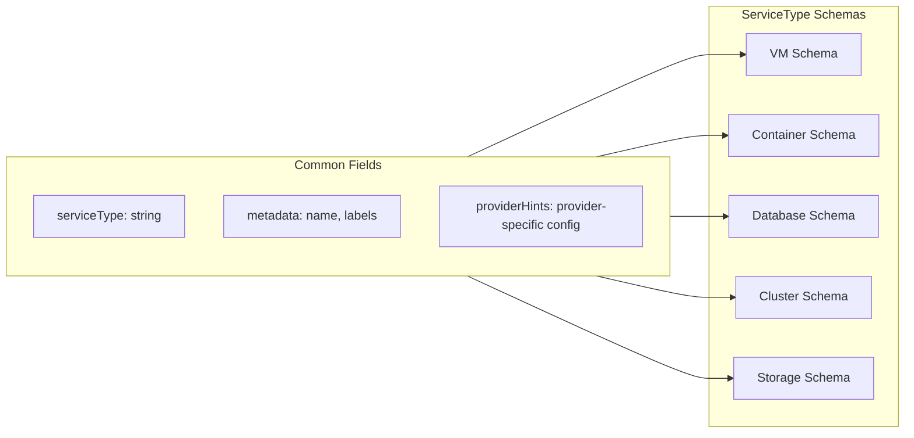
```mermaid
graph LR
    subgraph CommonFields[Common Fields]
        ST[serviceType: string]
        MD[metadata: name, labels]
        PH[providerHints: provider-specific config]
    end

    subgraph ServiceTypeSchemas[ServiceType Schemas]
        VM[VM Schema]
        CT[Container Schema]
        DBS[Database Schema]
        CL[Cluster Schema]
        STG[Storage Schema]
    end

    CommonFields --> VM
    CommonFields --> CT
    CommonFields --> DBS
    CommonFields --> CL
    CommonFields --> STG
```

### 3.2 Supported ServiceTypes

#### VM (`serviceType: vm`)

| Field                 | Type    | Required | Description                                   |
| --------------------- | ------- | -------- | --------------------------------------------- |
| `vcpu.count`          | integer | yes      | Number of virtual CPUs                        |
| `memory.size`         | string  | yes      | Memory size (e.g., `"8GB"`)                   |
| `storage.disks[]`     | array   | no       | Disks; root disk must be named `"boot"`       |
| `guestOS.type`        | string  | yes      | OS image (e.g., `"rhel-9"`, `"ubuntu-22.04"`) |
| `access.sshPublicKey` | string  | no       | SSH public key for access                     |

#### Container (`serviceType: container`)

| Field                      | Type    | Required | Description                                    |
| -------------------------- | ------- | -------- | ---------------------------------------------- |
| `image.reference`          | string  | yes      | Container image (e.g., `"quay.io/myapp:v1.2"`) |
| `resources.cpu.min/max`    | integer | yes      | CPU requests/limits                            |
| `resources.memory.min/max` | string  | yes      | Memory requests/limits                         |
| `process.command`          | array   | no       | Entrypoint command                             |
| `process.env[]`            | array   | no       | Environment variables                          |
| `network.ports[]`          | array   | no       | Container ports                                |

#### Database (`serviceType: database`)

| Field               | Type    | Required | Description                            |
| ------------------- | ------- | -------- | -------------------------------------- |
| `engine`            | string  | yes      | Database engine (e.g., `"postgresql"`) |
| `version`           | string  | yes      | Engine version                         |
| `resources.cpu`     | integer | yes      | CPU allocation                         |
| `resources.memory`  | string  | yes      | Memory allocation                      |
| `resources.storage` | string  | yes      | Storage allocation                     |

#### Cluster (`serviceType: cluster`)

| Field                                   | Type    | Required | Description                           |
| --------------------------------------- | ------- | -------- | ------------------------------------- |
| `version`                               | string  | yes      | Kubernetes version                    |
| `nodes.controlPlane.count`              | integer | yes      | Control plane node count (1, 3, or 5) |
| `nodes.controlPlane.cpu/memory/storage` | various | yes      | Control plane resources               |
| `nodes.worker.count`                    | integer | yes      | Worker node count                     |
| `nodes.worker.cpu/memory/storage`       | various | yes      | Worker node resources                 |

#### Storage (`serviceType: storage`)

| Field                                   | Type   | Required | Description                                                  |
| --------------------------------------- | ------ | -------- | ------------------------------------------------------------ |
| `capacity`                              | string | yes      | Volume size (e.g., `"100Gi"`, `"1TB"`)                       |
| `providerHints.kubernetes.storageClass` | string | no       | Kubernetes StorageClass name                                 |
| `providerHints.kubernetes.volumeMode`   | string | no       | `Filesystem` or `Block`                                      |
| `providerHints.kubernetes.accessMode`   | string | no       | PVC access mode (e.g., `"ReadWriteOnce"`, `"ReadWriteMany"`) |

---

## 4. Managing CatalogItems

CatalogItems wrap ServiceType schemas with defaults, validation rules, and
editability constraints. They enable administrators to create curated service
offerings for end users.

### 4.1 Create CatalogItem

An administrator defines a CatalogItem by specifying the target ServiceType,
field defaults, editability flags, and validation schemas.

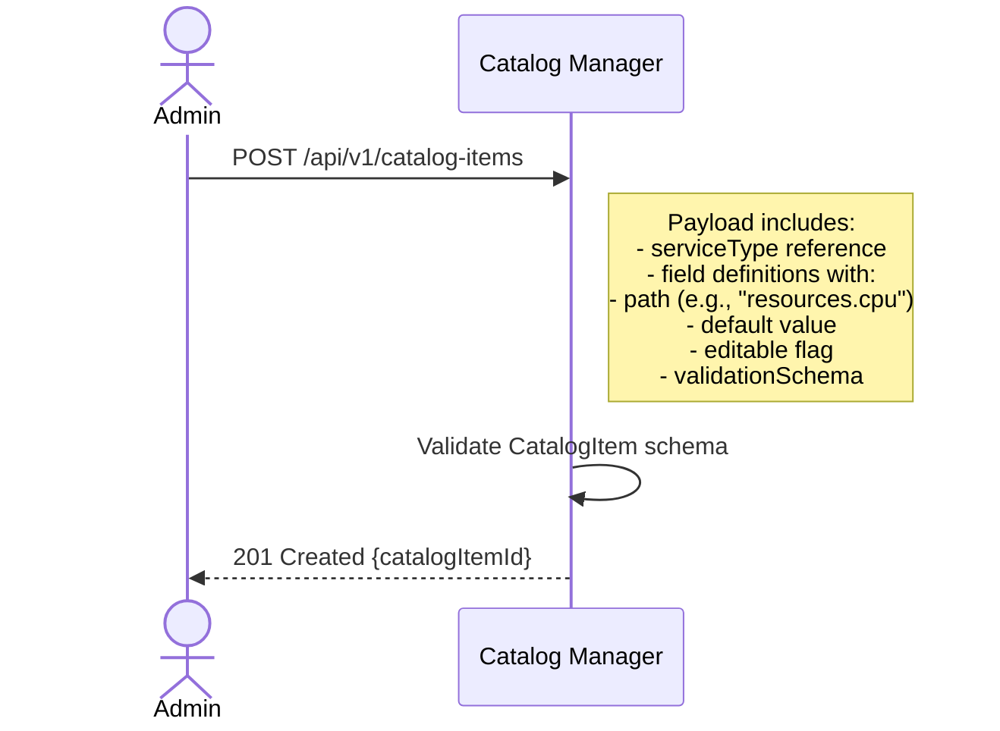
```mermaid
sequenceDiagram
    actor Admin
    participant CM as Catalog Manager

    Admin->>CM: POST /api/v1/catalog-items
    Note right of CM: Payload includes:<br/>- serviceType reference<br/>- field definitions with:<br/>  - path (e.g., "resources.cpu")<br/>  - default value<br/>  - editable flag<br/>  - validationSchema

    CM->>CM: Validate CatalogItem schema
    CM-->>Admin: 201 Created {catalogItemId}
```

**CatalogItem example:**

```yaml
apiVersion: v1alpha1
kind: CatalogItem
metadata:
  name: production-postgres
spec:
  serviceType: database
  fields:
    - path: "engine"
      default: "postgresql"
      editable: false
    - path: "version"
      editable: true
      default: "15"
      validationSchema:
        enum: ["14", "15", "16"]
    - path: "resources.cpu"
      editable: true
      default: 4
      validationSchema:
        minimum: 2
        maximum: 16
    - path: "resources.memory"
      editable: true
      default: "16GB"
    - path: "resources.storage"
      editable: true
      default: "100GB"
```

**Storage CatalogItem example:**

```yaml
apiVersion: v1alpha1
kind: CatalogItem
metadata:
  name: standard-block-volume
spec:
  serviceType: storage
  fields:
    - path: "capacity"
      editable: true
      default: "100Gi"
      validationSchema:
        type: string
        pattern: '^[0-9]+(\.[0-9]+)?(Ei|Pi|Ti|Gi|Mi|Ki|E|P|T|G|M|K)?$'
    - path: "providerHints.kubernetes.storageClass"
      editable: false
      default: "gp3-csi"
    - path: "providerHints.kubernetes.volumeMode"
      editable: false
      default: "Filesystem"
    - path: "providerHints.kubernetes.accessMode"
      editable: false
      default: "ReadWriteOnce"
```

### 4.2 CatalogItem to ServiceType Translation

When a user orders an item from a CatalogItem, the system merges user input with
CatalogItem defaults and validates against the field schemas, producing a
ServiceType payload.

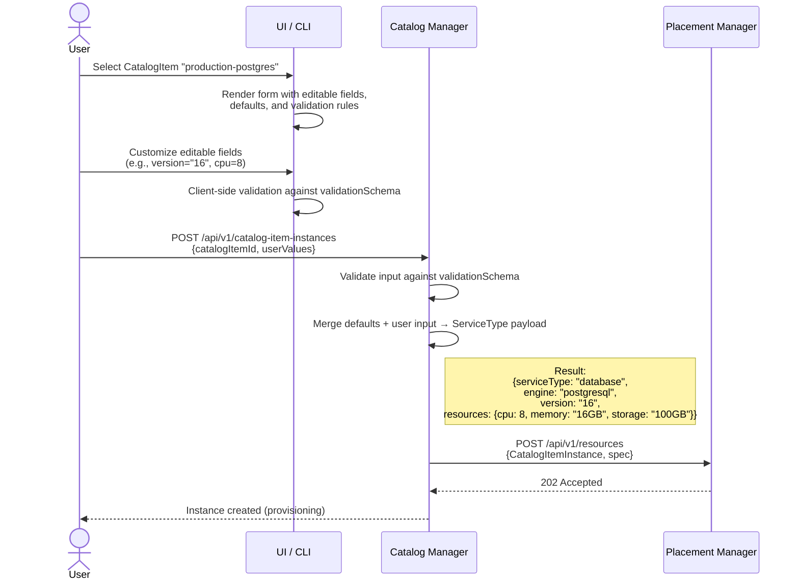
```mermaid
sequenceDiagram
    actor User
    participant UI as UI / CLI
    participant CM as Catalog Manager
    participant PM as Placement Manager

    User->>UI: Select CatalogItem "production-postgres"
    UI->>UI: Render form with editable fields,<br/>defaults, and validation rules
    User->>UI: Customize editable fields<br/>(e.g., version="16", cpu=8)
    UI->>UI: Client-side validation against validationSchema
    User->>CM: POST /api/v1/catalog-item-instances<br/>{catalogItemId, userValues}
    CM->>CM: Validate input against validationSchema
    CM->>CM: Merge defaults + user input → ServiceType payload
    Note right of CM: Result:<br/>{serviceType: "database",<br/> engine: "postgresql",<br/> version: "16",<br/> resources: {cpu: 8, memory: "16GB", storage: "100GB"}}
    CM->>PM: POST /api/v1/resources<br/>{CatalogItemInstance, spec}
    PM-->>CM: 202 Accepted
    CM-->>User: Instance created (provisioning)
```

---

## 5. Service Provider & Agent Lifecycle

Service Providers register with the Environment Agent in their target
environment. The Agent registers with DCM and acts as the intermediary for
resource operation requests. For full details on agent behavior, see the
[Environment Agent enhancement](/enhancements/environment-agent/environment-agent.md).

### 5.1 Service Provider Registration (SP → Agent)

The Agent supports a hybrid SP model: it ships with embedded SP code for known
service types (K8s Container, ACM Cluster, KubeVirt), enabled via configuration,
and also accepts external ("bring your own") SPs that register via the REST API.
Only one SP — embedded or external — may serve a given service type per agent;
duplicate registrations are rejected with `409 Conflict`. Embedded SPs register
internally at agent startup; external SPs register via `POST /api/v1/providers`.
Registration is idempotent — re-registering with the same name updates the
existing entry. External SPs periodically re-register to maintain their lease,
which also ensures that after an agent restart, SPs naturally rebuild the
agent's state.

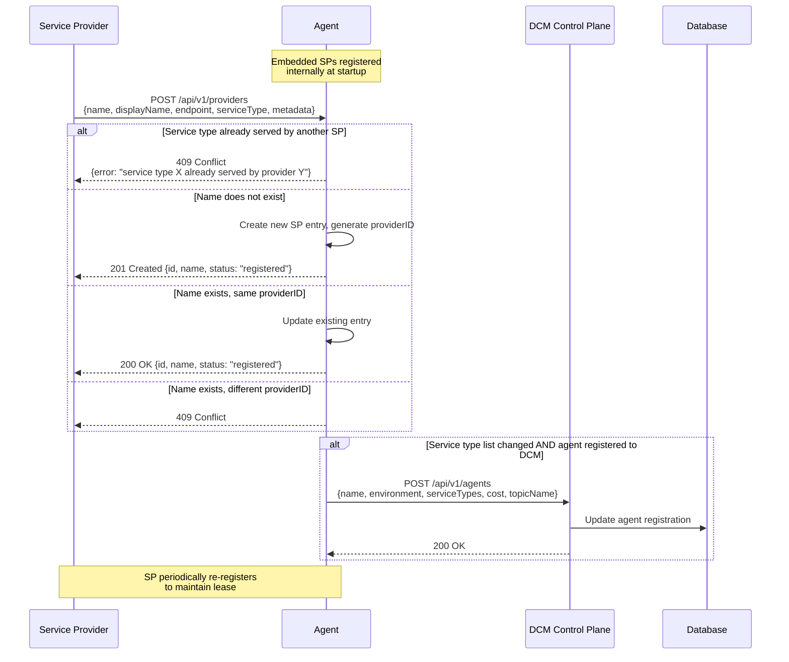
```mermaid
sequenceDiagram
    participant SP as Service Provider
    participant AG as Agent
    participant DCM as DCM Control Plane
    participant DB as Database

    Note over AG: Embedded SPs registered<br/>internally at startup

    SP->>AG: POST /api/v1/providers<br/>{name, displayName, endpoint, serviceType, metadata}

    alt Service type already served by another SP
        AG-->>SP: 409 Conflict<br/>{error: "service type X already served by provider Y"}
    else Name does not exist
        AG->>AG: Create new SP entry, generate providerID
        AG-->>SP: 201 Created {id, name, status: "registered"}
    else Name exists, same providerID
        AG->>AG: Update existing entry
        AG-->>SP: 200 OK {id, name, status: "registered"}
    else Name exists, different providerID
        AG-->>SP: 409 Conflict
    end

    alt Service type list changed AND agent registered to DCM
        AG->>DCM: POST /api/v1/agents<br/>{name, environment, serviceTypes, cost, topicName}
        DCM->>DB: Update agent registration
        DCM-->>AG: 200 OK
    end

    Note over SP,AG: SP periodically re-registers<br/>to maintain lease
```

**Registration payload example (SP → Agent):**

```json
{
  "name": "kubevirt-sp",
  "displayName": "KubeVirt Service Provider",
  "endpoint": "https://sp1.example.com/api/v1/vm",
  "serviceType": "vm",
  "metadata": {
    "region": "us-east-1",
    "resources": {
      "totalCpu": 200,
      "totalMemory": "1TB",
      "totalStorage": "2TB"
    }
  }
}
```

### 5.2 Agent Registration (Agent → DCM)

The Agent registers with DCM after creating its messaging topics and after at
least one SP (embedded or external) is registered and healthy. Registration is
idempotent — the agent `name` is the natural key. On restart, the agent
re-registers; DCM resets the heartbeat tracker. For full registration details,
see the
[Environment Agent enhancement](/enhancements/environment-agent/environment-agent.md).

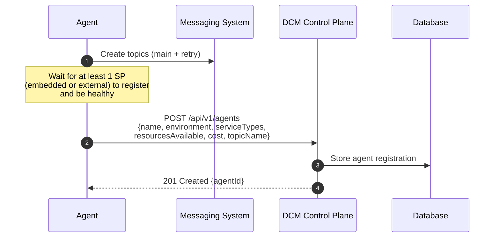
```mermaid
sequenceDiagram
    autonumber
    participant AG as Agent
    participant MS as Messaging System
    participant DCM as DCM Control Plane
    participant DB as Database

    AG->>MS: Create topics (main + retry)
    Note over AG: Wait for at least 1 SP<br/>(embedded or external) to register<br/>and be healthy

    AG->>DCM: POST /api/v1/agents<br/>{name, environment, serviceTypes,<br/>resourcesAvailable, cost, topicName}
    DCM->>DB: Store agent registration
    DCM-->>AG: 201 Created {agentId}
```

**Registration payload (Agent → DCM):**

```json
{
  "name": "agent-prod-eu-west-1",
  "environment": "prod-eu-west-1",
  "serviceTypes": ["vm", "container"],
  "resourcesAvailable": {
    "totalCpu": 200,
    "totalMemory": "1TB",
    "totalStorage": "2TB"
  },
  "cost": "medium",
  "topicName": "dcm.agents.agent-prod-eu-west-1"
}
```

### 5.3 Health Monitoring

#### 5.3.1 SP Health (Agent → SP)

The Agent monitors each registered SP's health using a three-state model. The
monitoring mechanism differs by SP type: embedded SPs are checked in-process (no
network call), while external SPs are checked by polling their `/health`
endpoint at a configurable interval.

##### Health State Diagram

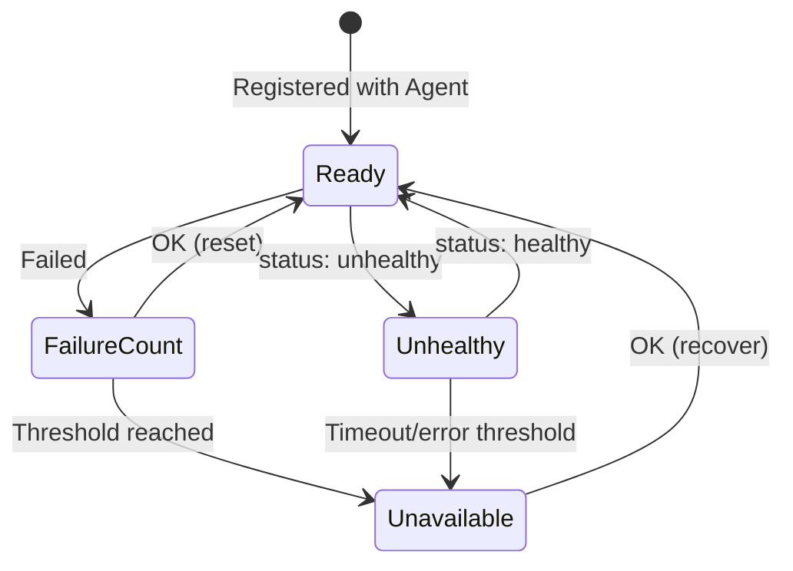
```mermaid
stateDiagram-v2
    [*] --> Ready: Registered with Agent

    Ready --> FailureCount: Failed
    FailureCount --> Ready: OK (reset)
    FailureCount --> Unavailable: Threshold reached

    Ready --> Unhealthy: status: unhealthy
    Unhealthy --> Ready: status: healthy
    Unhealthy --> Unavailable: Timeout/error threshold

    Unavailable --> Ready: OK (recover)
```

Three health states:

- **Ready**: SP is healthy and eligible for routing.
- **Unhealthy**: SP is reachable but reports its backing provider is down. The
  Agent keeps the service type in its advertised list but stops routing requests
  to this SP; incoming requests are held in the retry topic until the SP
  recovers or becomes Unavailable.
- **Unavailable**: SP is unreachable after exceeding the failure threshold. The
  Agent removes the service type from its advertised list and updates DCM.

##### Health Check Sequence

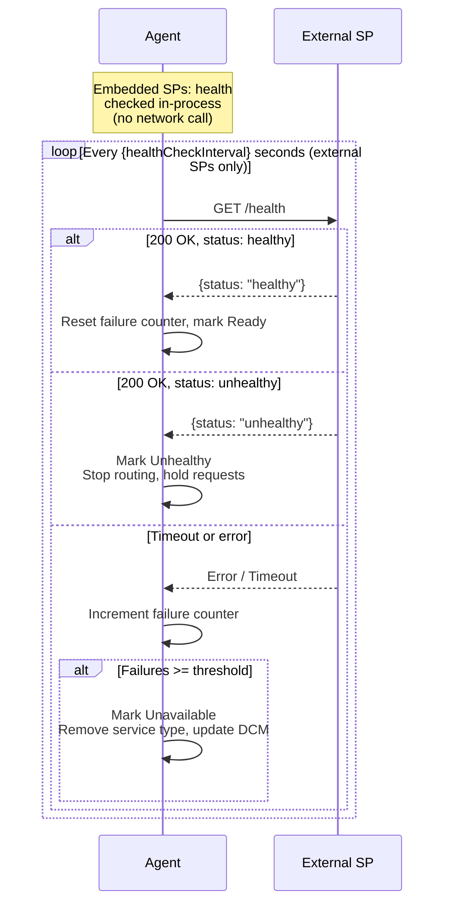
```mermaid
sequenceDiagram
    participant AG as Agent
    participant SP as External SP

    Note over AG: Embedded SPs: health<br/>checked in-process<br/>(no network call)

    loop Every {healthCheckInterval} seconds (external SPs only)
        AG->>SP: GET /health
        alt 200 OK, status: healthy
            SP-->>AG: {status: "healthy"}
            AG->>AG: Reset failure counter, mark Ready
        else 200 OK, status: unhealthy
            SP-->>AG: {status: "unhealthy"}
            AG->>AG: Mark Unhealthy<br/>Stop routing, hold requests
        else Timeout or error
            SP-->>AG: Error / Timeout
            AG->>AG: Increment failure counter
            alt Failures >= threshold
                AG->>AG: Mark Unavailable<br/>Remove service type, update DCM
            end
        end
    end
```

#### 5.3.2 Agent Health (Agent → DCM heartbeats)

The Agent reports its own liveness to DCM via periodic REST heartbeats. DCM
tracks the last heartbeat timestamp for each agent and marks the agent as
Unavailable if no heartbeat is received within a configurable threshold.

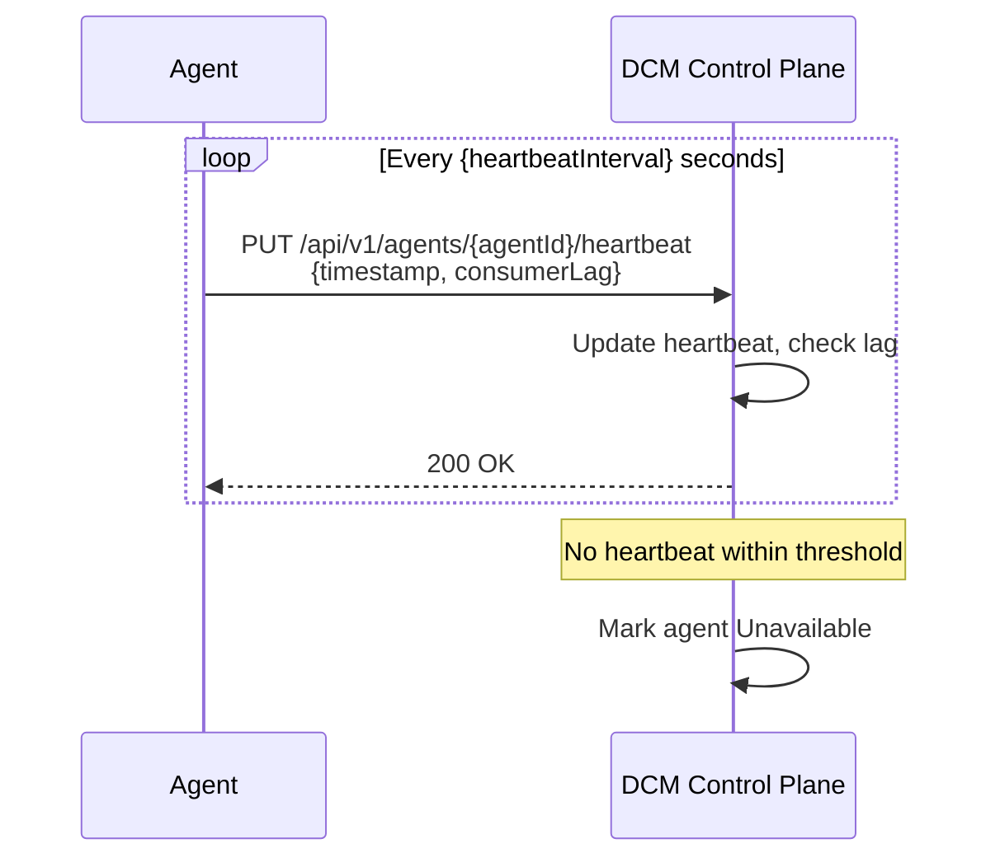
```mermaid
sequenceDiagram
    participant AG as Agent
    participant DCM as DCM Control Plane

    loop Every {heartbeatInterval} seconds
        AG->>DCM: PUT /api/v1/agents/{agentId}/heartbeat<br/>{timestamp, consumerLag}
        DCM->>DCM: Update heartbeat, check lag
        DCM-->>AG: 200 OK
    end

    Note over DCM: No heartbeat within threshold
    DCM->>DCM: Mark agent Unavailable
```

#### 5.3.3 Consumer Lag Monitoring

The Agent self-reports its consumer lag in each heartbeat. If the lag exceeds
`consumerLagThreshold`, DCM marks the agent as **Congested** and stops routing
new requests to it. When the lag drops below the threshold, the Congested state
is cleared.

##### Agent Health State Diagram

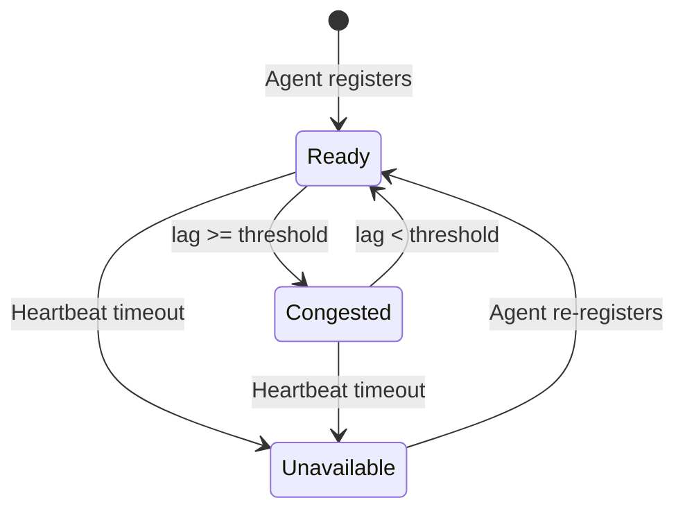
```mermaid
stateDiagram-v2
    [*] --> Ready: Agent registers
    Ready --> Congested: lag >= threshold
    Congested --> Ready: lag < threshold
    Ready --> Unavailable: Heartbeat timeout
    Congested --> Unavailable: Heartbeat timeout
    Unavailable --> Ready: Agent re-registers
```

### 5.4 Service Provider Status Reporting

> **Note:** Status reporting is not impacted by the Agent layer. SPs publish
> status CloudEvents directly to the Messaging System. The Agent is not in the
> status-reporting path.

Service Providers report instance status changes to DCM via CloudEvents
published to a messaging system (NATS). This decoupled approach supports
multiple consumers (billing, auditing, etc.) and scales independently.

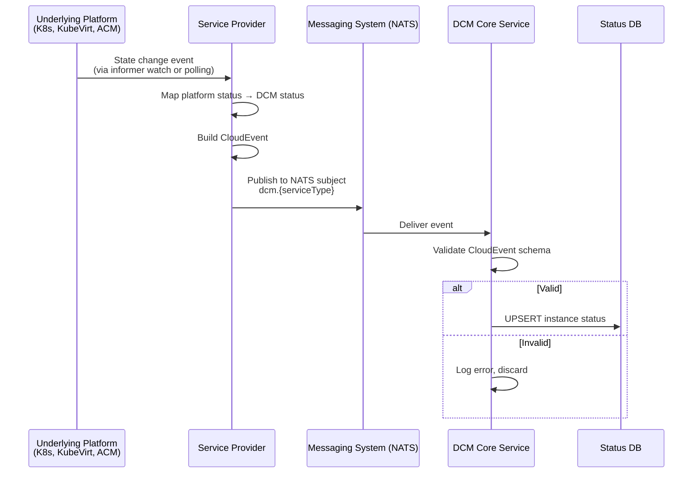
```mermaid
sequenceDiagram
    participant Platform as Underlying Platform<br/>(K8s, KubeVirt, ACM)
    participant SP as Service Provider
    participant MS as Messaging System (NATS)
    participant DCM as DCM Core Service
    participant DB as Status DB

    Platform->>SP: State change event<br/>(via informer watch or polling)
    SP->>SP: Map platform status → DCM status
    SP->>SP: Build CloudEvent
    SP->>MS: Publish to NATS subject<br/>dcm.{serviceType}<br/>

    MS->>DCM: Deliver event
    DCM->>DCM: Validate CloudEvent schema
    alt Valid
        DCM->>DB: UPSERT instance status
    else Invalid
        DCM->>DCM: Log error, discard
    end
```

**Status enums by ServiceType:**

| VM           | Container | Cluster  | Storage      |
| ------------ | --------- | -------- | ------------ |
| PROVISIONING | PENDING   | CREATING | PROVISIONING |
| RUNNING      | RUNNING   | ACTIVE   | RUNNING      |
| STOPPED      | SUCCEEDED | UPDATING |              |
| PAUSED       | FAILED    | DEGRADED |              |
| FAILED       | UNKNOWN   | DELETED  | FAILED       |
| DELETING     |           |          | DELETING     |
| DELETED      |           |          | DELETED      |

### 5.5 Agent Lifecycle

This section provides a brief overview of the agent lifecycle. For full details,
see the
[Environment Agent enhancement](/enhancements/environment-agent/environment-agent.md).

**Startup:**

1. Agent registers its configured embedded SPs internally (K8s Container, ACM
   Cluster, KubeVirt — each if enabled in config)
2. Agent creates messaging topics (main topic + retry topic)
3. Agent waits for at least one SP (embedded or external) to be registered and
   healthy
4. Agent registers with DCM via `POST /api/v1/agents`
5. Agent begins periodic heartbeats and SP health checking

**Restart:**

1. Agent re-registers with DCM (idempotent; DCM resets heartbeat tracker)
2. Embedded SPs register internally at startup; external SPs naturally
   re-register via periodic lease renewal, rebuilding agent state
3. Unconsumed messages on both main and retry topics survive (messaging system
   persistence)
4. Agent resumes consuming from both topics once fully initialized

---

## 6. CatalogItemInstance Creation (End-to-End)

This is the primary user flow: creating an infrastructure resource from a
CatalogItem. The request flows through the Catalog Manager, Placement Manager
(with policy evaluation), SP Resource Manager (which publishes to the messaging
system), the Environment Agent, and finally to the selected Service Provider.

### 6.1 Full Creation Flow

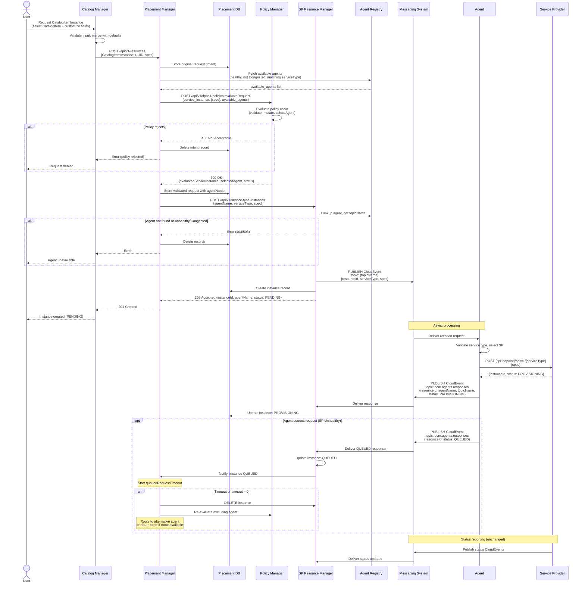
```mermaid
sequenceDiagram
    actor User
    participant CM as Catalog Manager
    participant PM as Placement Manager
    participant DB as Placement DB
    participant PE as Policy Manager
    participant SPRM as SP Resource Manager
    participant AR as Agent Registry
    participant MS as Messaging System
    participant AG as Agent
    participant SP as Service Provider

    User->>CM: Request CatalogItemInstance<br/>(select CatalogItem + customize fields)
    CM->>CM: Validate input, merge with defaults
    CM->>PM: POST /api/v1/resources<br/>{CatalogItemInstance: UUID, spec}

    PM->>DB: Store original request (intent)

    PM->>AR: Fetch available agents<br/>(healthy, not Congested, matching serviceType)
    AR-->>PM: available_agents list

    PM->>PE: POST /api/v1alpha1/policies:evaluateRequest<br/>{service_instance: {spec}, available_agents}
    PE->>PE: Evaluate policy chain<br/>(validate, mutate, select Agent)

    alt Policy rejects
        PE-->>PM: 406 Not Acceptable
        PM->>DB: Delete intent record
        PM-->>CM: Error (policy rejected)
        CM-->>User: Request denied
    end

    PE-->>PM: 200 OK<br/>{evaluatedServiceInstance, selectedAgent, status}
    PM->>DB: Store validated request with agentName

    PM->>SPRM: POST /api/v1/service-type-instances<br/>{agentName, serviceType, spec}

    SPRM->>AR: Lookup agent, get topicName
    alt Agent not found or unhealthy/Congested
        SPRM-->>PM: Error (404/503)
        PM->>DB: Delete records
        PM-->>CM: Error
        CM-->>User: Agent unavailable
    end

    SPRM->>MS: PUBLISH CloudEvent<br/>topic: {topicName}<br/>{resourceId, serviceType, spec}
    SPRM->>DB: Create instance record
    SPRM-->>PM: 202 Accepted {instanceId, agentName, status: PENDING}
    PM-->>CM: 201 Created
    CM-->>User: Instance created (PENDING)

    Note over MS,AG: Async processing
    MS->>AG: Deliver creation request
    AG->>AG: Validate service type, select SP
    AG->>SP: POST {spEndpoint}/api/v1/{serviceType}<br/>{spec}
    SP-->>AG: {instanceId, status: PROVISIONING}
    AG->>MS: PUBLISH CloudEvent<br/>topic: dcm.agents.responses<br/>{resourceId, agentName, topicName,<br/>status: PROVISIONING}
    MS->>SPRM: Deliver response
    SPRM->>DB: Update instance: PROVISIONING

    opt Agent queues request (SP Unhealthy)
        AG->>MS: PUBLISH CloudEvent<br/>topic: dcm.agents.responses<br/>{resourceId, status: QUEUED}
        MS->>SPRM: Deliver QUEUED response
        SPRM->>SPRM: Update instance: QUEUED
        SPRM->>PM: Notify: instance QUEUED

        Note over PM: Start queuedRequestTimeout
        alt Timeout or timeout = 0
            PM->>SPRM: DELETE instance
            PM->>PE: Re-evaluate excluding agent
            Note over PM: Route to alternative agent<br/>or return error if none available
        end
    end

    Note over SP,MS: Status reporting (unchanged)
    SP->>MS: Publish status CloudEvents
    MS->>SPRM: Deliver status updates
```

When the SP for the requested service type on the agent is Unhealthy, the Agent
holds the request in its retry topic and responds with a QUEUED CloudEvent. DCM
records the QUEUED status. If the SP recovers, the Agent processes the held
request. If the SP becomes Unavailable, the Agent rejects the held request with
an error CloudEvent. The Placement Manager handles the QUEUED status via a
`queuedRequestTimeout` timer (see
[6.2 Placement Manager Flow](#62-placement-manager-flow)).

### 6.2 Placement Manager Flow

The Placement Manager is the central orchestrator. It preserves the user's
original intent, fetches available agents, delegates policy evaluation, and
coordinates with the SP Resource Manager.

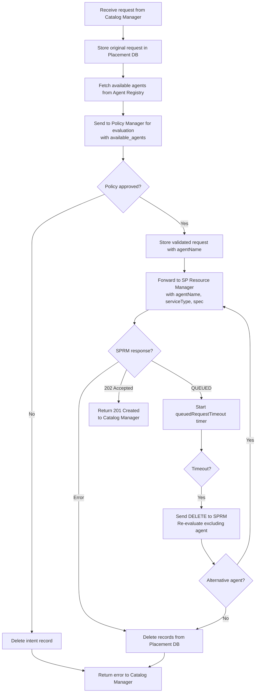
```mermaid
flowchart TD
    A[Receive request from Catalog Manager] --> B[Store original request in Placement DB]
    B --> C[Fetch available agents from Agent Registry]
    C --> D[Send to Policy Manager for evaluation<br/>with available_agents]
    D --> E{Policy approved?}
    E -->|No| F[Delete intent record]
    F --> G[Return error to Catalog Manager]
    E -->|Yes| H[Store validated request with agentName]
    H --> I[Forward to SP Resource Manager<br/>with agentName, serviceType, spec]
    I --> J{SPRM response?}
    J -->|Error| K[Delete records from Placement DB]
    K --> G
    J -->|202 Accepted| L[Return 201 Created<br/>to Catalog Manager]
    J -->|QUEUED| M[Start queuedRequestTimeout timer]
    M --> N{Timeout?}
    N -->|Yes| O[Send DELETE to SPRM<br/>Re-evaluate excluding agent]
    O --> P{Alternative agent?}
    P -->|Yes| I
    P -->|No| K
```

**Request payload (Catalog Manager → Placement Manager):**

```json
{
  "CatalogItemInstance": "4baa35eb-e70d-4d37-867d-0f4efa21d05c",
  "spec": {
    "serviceType": "vm",
    "memory": { "size": "2GB" },
    "vcpu": { "count": 2 },
    "guestOS": { "type": "fedora-39" },
    "access": { "sshPublicKey": "ssh-ed25519 ..." },
    "metadata": { "name": "fedora-vm" }
  }
}
```

**Response payload (Placement Manager → Catalog Manager):**

```json
{
  "CatalogItemInstanceId": "f3645f8f-82c1-4efb-888f-318c0ac81a08",
  "resource_name": "fedora-vm",
  "agentName": "agent-prod-eu-west-1",
  "id": "08aa81d1-a0d2-4d5f-a4df-b80addf07781"
}
```

### 6.3 SP Resource Manager Flow

The SP Resource Manager handles Agent lookup and publishes creation requests as
CloudEvents to the agent's messaging topic. It no longer calls SP REST endpoints
directly.

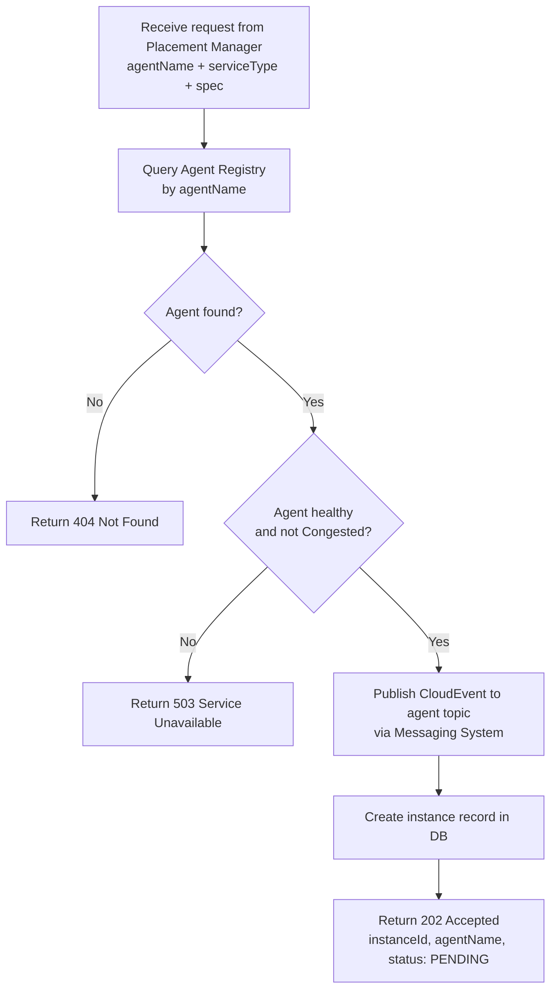
```mermaid
flowchart TD
    A[Receive request from Placement Manager<br/>agentName + serviceType + spec] --> B[Query Agent Registry<br/>by agentName]
    B --> C{Agent found?}
    C -->|No| D[Return 404 Not Found]
    C -->|Yes| E{Agent healthy<br/>and not Congested?}
    E -->|No| F[Return 503 Service Unavailable]
    E -->|Yes| G[Publish CloudEvent to agent topic<br/>via Messaging System]
    G --> H[Create instance record in DB]
    H --> I[Return 202 Accepted<br/>instanceId, agentName, status: PENDING]
```

### 6.4 Service Provider Instance Creation

Each Service Provider translates the provider-agnostic ServiceType spec into
platform-native resources.

> **Note:** Each service type is served by exactly one SP (embedded or external)
> per agent — there is no SP selection strategy. The Agent forwards the request
> to the SP via an in-process call (for embedded SPs) or via REST (for external
> SPs). The SP's internal behavior is unchanged.

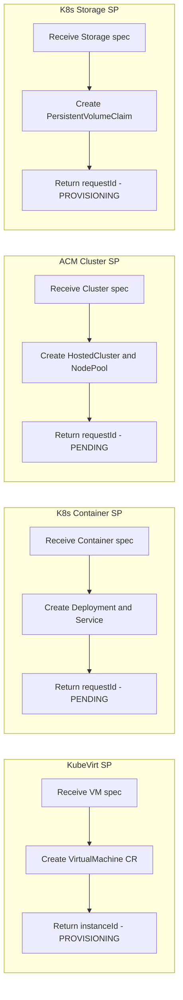
```mermaid
flowchart LR
    subgraph KubeVirtSP[KubeVirt SP]
        A1[Receive VM spec] --> A2[Create VirtualMachine CR]
        A2 --> A3[Return instanceId - PROVISIONING]
    end

    subgraph K8sContainerSP[K8s Container SP]
        B1[Receive Container spec] --> B2[Create Deployment and Service]
        B2 --> B3[Return requestId - PENDING]
    end

    subgraph ACMClusterSP[ACM Cluster SP]
        C1[Receive Cluster spec] --> C2[Create HostedCluster and NodePool]
        C2 --> C3[Return requestId - PENDING]
    end

    subgraph K8sStorageSP[K8s Storage SP]
        D1[Receive Storage spec] --> D2[Create PersistentVolumeClaim]
        D2 --> D3[Return requestId - PROVISIONING]
    end
```

### 6.5 Continuous Status Reporting

> **Note:** Status reporting is not impacted by the Agent layer. SPs publish
> status CloudEvents directly to the Messaging System, bypassing the Agent. This
> path is unchanged from the pre-agent architecture.

After instance creation, Service Providers continuously monitor the underlying
platform and report status changes via CloudEvents.

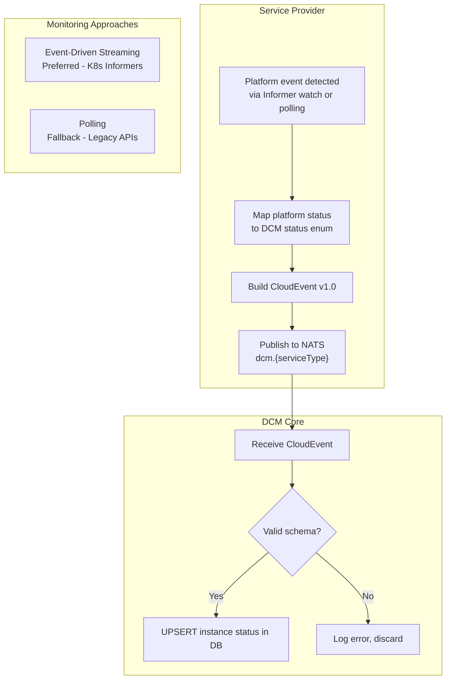
```mermaid
flowchart TD
    subgraph Service Provider
        A[Platform event detected<br/>via Informer watch or polling]
        A --> B[Map platform status<br/>to DCM status enum]
        B --> C[Build CloudEvent v1.0]
        C --> D["Publish to NATS<br/>dcm.{serviceType}"]
    end

    subgraph DCM Core
        D --> E[Receive CloudEvent]
        E --> F{Valid schema?}
        F -->|Yes| G[UPSERT instance status in DB]
        F -->|No| H[Log error, discard]
    end

    subgraph Monitoring Approaches
        I[Event-Driven Streaming<br/>Preferred - K8s Informers]
        J[Polling<br/>Fallback - Legacy APIs]
    end
```

**Platform status mapping examples:**

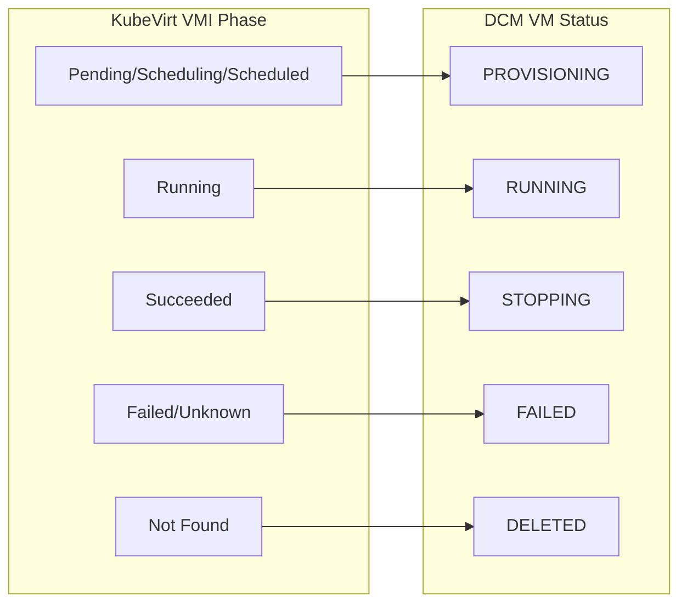
```mermaid
graph LR
    subgraph KubeVirt VMI Phase
        VP1[Pending/Scheduling/Scheduled]
        VP2[Running]
        VP3[Succeeded]
        VP4[Failed/Unknown]
        VP5[Not Found]
    end

    subgraph DCM VM Status
        DS1[PROVISIONING]
        DS2[RUNNING]
        DS3[STOPPING]
        DS4[FAILED]
        DS5[DELETED]
    end

    VP1 --> DS1
    VP2 --> DS2
    VP3 --> DS3
    VP4 --> DS4
    VP5 --> DS5
```

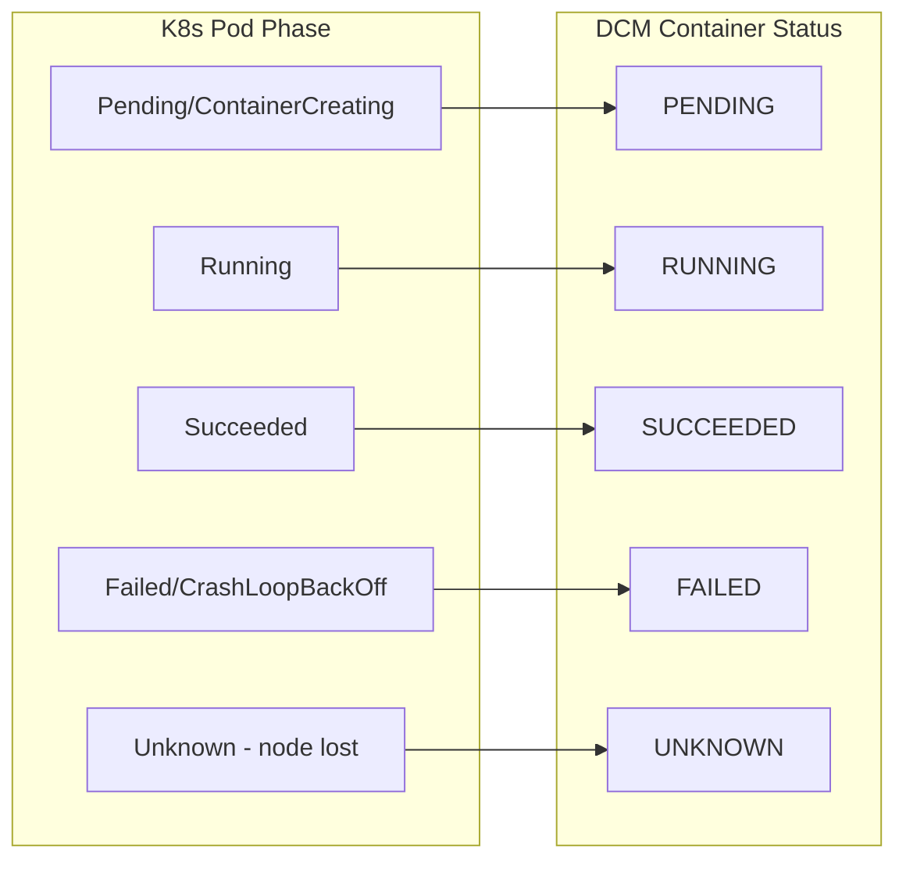
```mermaid
graph LR
    subgraph K8s Pod Phase
        KP1[Pending/ContainerCreating]
        KP2[Running]
        KP3[Succeeded]
        KP4[Failed/CrashLoopBackOff]
        KP5[Unknown - node lost]
    end

    subgraph DCM Container Status
        CS1[PENDING]
        CS2[RUNNING]
        CS3[SUCCEEDED]
        CS4[FAILED]
        CS5[UNKNOWN]
    end

    KP1 --> CS1
    KP2 --> CS2
    KP3 --> CS3
    KP4 --> CS4
    KP5 --> CS5
```

```mermaid
graph LR
    subgraph HostedCluster Conditions
        HC1[Progressing=Unknown]
        HC2[Progressing=True, Available=False]
        HC3[Available=True, Progressing=False]
        HC4[Degraded=True]
        HC5[Not Found]
    end

    subgraph DCM Cluster Status
        DC1[PENDING]
        DC2[PROVISIONING]
        DC3[READY]
        DC4[FAILED]
        DC5[DELETED]
    end

    HC1 --> DC1
    HC2 --> DC2
    HC3 --> DC3
    HC4 --> DC4
    HC5 --> DC5
```

```mermaid
graph LR
    subgraph K8s PVC Phase
        PVC1[Pending]
        PVC2[Bound - resizing]
        PVC3[Bound]
        PVC4[Lost]
        PVC5[deletionTimestamp set]
        PVC6[Not Found]
    end

    subgraph DCM Storage Status
        SS1[PROVISIONING]
        SS2[PROVISIONING]
        SS3[RUNNING]
        SS4[FAILED]
        SS5[DELETING]
        SS6[DELETED]
    end

    PVC1 --> SS1
    PVC2 --> SS2
    PVC3 --> SS3
    PVC4 --> SS4
    PVC5 --> SS5
    PVC6 --> SS6
```

### 6.6 Deletion Flow

The deletion flow follows the same architecture as creation: the request is
published as a CloudEvent to the agent's messaging topic, and the Agent routes
it to the appropriate SP.

```mermaid
sequenceDiagram
    actor User
    participant CM as Catalog Manager
    participant PM as Placement Manager
    participant DB as Placement DB
    participant SPRM as SP Resource Manager
    participant MS as Messaging System
    participant AG as Agent
    participant SP as Service Provider

    User->>CM: Delete CatalogItemInstance
    CM->>PM: DELETE /api/v1/resources/{resourceId}
    PM->>DB: Lookup resource (agentName, serviceType, instanceId)

    PM->>SPRM: DELETE /api/v1/service-type-instances/{instanceId}
    SPRM->>MS: PUBLISH CloudEvent<br/>topic: {topicName}<br/>type: dcm.request.delete<br/>{resourceId, serviceType}
    SPRM-->>PM: 202 Accepted

    MS->>AG: Deliver deletion request
    AG->>SP: DELETE {spEndpoint}/api/v1/{serviceType}/{resourceId}
    SP-->>AG: {status: DELETING}
    AG->>MS: PUBLISH CloudEvent<br/>topic: dcm.agents.responses<br/>{resourceId, agentName, topicName,<br/>status: DELETING}

    opt Agent queues request (SP Unhealthy)
        AG->>MS: PUBLISH CloudEvent<br/>topic: dcm.agents.responses<br/>{resourceId, status: QUEUED}
        MS->>SPRM: Deliver QUEUED response
        SPRM->>SPRM: Update instance: QUEUED
        SPRM->>PM: Notify: deletion QUEUED

        Note over PM: Resource stays DELETING.<br/>Deletion cannot be re-routed.<br/>Agent holds the request in its<br/>retry topic for automatic resolution.

        alt SP recovers — Agent processes held deletion
            AG->>SP: DELETE {spEndpoint}/api/v1/{serviceType}/{resourceId}
            SP-->>AG: {status: DELETING}
            AG->>MS: PUBLISH CloudEvent<br/>{resourceId, status: DELETING}
        else SP becomes Unavailable — Agent rejects
            AG->>MS: PUBLISH CloudEvent<br/>{resourceId, error: "SP unavailable"}
            MS->>SPRM: Deliver error
            Note over SPRM: Enqueue in cleanup queue<br/>for deferred retry.<br/>Resource stays DELETING.
        end
    end

    Note over SP: SP manages deletion<br/>and reports final status
    SP->>MS: CloudEvent {status: DELETED}
    MS->>SPRM: Status update
    SPRM->>DB: Update status: DELETED
```
